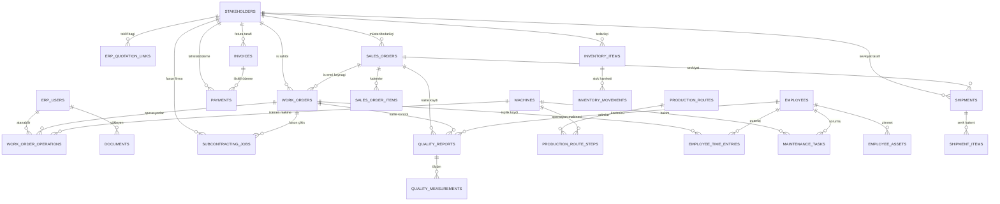

# DAYAN Disli ERP Mimarisi

## 1) Proje Amaci
DAYAN Disli için modüler, web tabanli, küçük ölçekli üretim ERP sistemi gelistirmek.

Hedef, 10 kisilik metal isleme/disli üretim atölyesi için hizli, yalin ve operasyon odakli bir yapi kurmaktir. Sistem, tekliften siparise, is emrinden kaliteye ve sevkiyata kadar günlük akislari tek bir panelde yönetilebilir hale getirmelidir.

## 2) ERP Modül Listesi
- Ana Panel
- CRM ve Paydas Yönetimi
- Teklif Yönetimi
- Siparis Yönetimi
- Üretim ve Rota Yönetimi
- Is Emirleri
- Operasyon Takibi
- Fason Takibi
- Teknik Resim ve Doküman Yönetimi
- Stok ve Ambar Yönetimi
- Takimhane ve Ölçüm Aletleri
- Ön Muhasebe ve Finans
- Kasa/Banka
- Fatura Takibi
- IK ve Personel
- Puantaj/Mesai
- Lojistik ve Sevkiyat
- Kalite Kontrol
- Makine Bakim
- Raporlama
- Sistem Ayarlari

## 3) Üretim Varsayimlari
- Islerin büyük kismi özel imalat ve müsteri bazlidir.
- Tekrarli isler için BOM faydali olsa da ilk asamada zorunlu degildir.
- Ilk fazda karmasik MRP yerine rota ve is emri takibi daha kritiktir.
- Atölye küçük oldugu için arayüz çok hizli, basit ve güncellenmesi kolay olmalidir.
- Üretim durumlari sahada hizla güncellenebilmelidir.

## 4) Varlik Iliski Diyagrami (Mermaid ERD)

## 5) Veri Sahipligi ve Geçis Prensibi
- Mevcut üretim tablolari korunur: `quotations`, `customer_profile`, `customers_full`, `products`, `orders`, `order_items`, `settings`, `allowed_emails`, `admin_users`.
- ERP için yeni tablolar eklenir; eski tablolar silinmez.
- Veri geçisi kademeli yapilir; özellikle müsteri yapilari zamanla `stakeholders` tablosuna eslenir.
- Yikici migration (drop/delete) varsayilan olarak yasaktir.

## 6) Güvenlik Tasarimi
- Kimlik dogrulama Supabase Auth (email/password) ile yapilir.
- Yetkilendirme `admin_users` ve/veya `erp_users` gibi uygulama tablolari üzerinden yönetilir.
- ERP tablolarinda RLS zorunludur.
- Sifreler hiçbir custom tabloda saklanmaz.
- Ortam degiskenleri (`VITE_SUPABASE_URL`, anahtarlar vb.) sadece güvenli build/deploy pipeline ile enjekte edilir.

## 7) Uygulama Yol Haritasi
### MVP (Faz 1)
- ERP ana layout ve modül rotalari
- CRM (paydas listesi + temel kayit)
- ERP siparisleri (sales_orders)
- Is emirleri ve operasyon iskeleti
- Stok ana ekrani ve kritik stok görünümü
- Kalite, bakim, sevkiyat, finans için temel liste ekranlari
- ERP dashboard metrikleri

### Faz 2
- Modül bazli detay formlar
- Durum geçis otomasyonlari
- Teklif ? ERP satis siparisi dönüstürme
- Rota sablonlarindan is emri operasyon üretme

### Faz 3
- Gelismis raporlama ve performans KPI
- Döküman/teknik resim yönetim entegrasyonu
- Gelismis yetki matrisi ve denetim loglari

### Faz 4
- Mobil saha ekranlari
- Bildirim ve hatirlatma akislari
- Ileri planlama ve kapasite simülasyonlari
