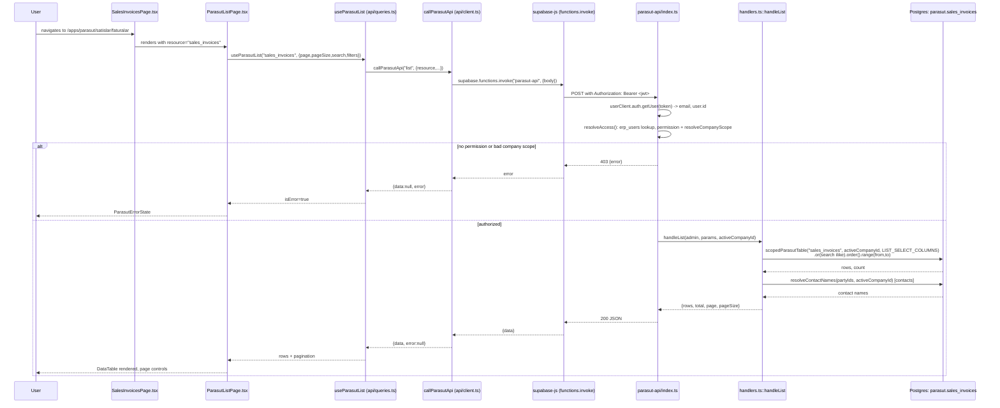
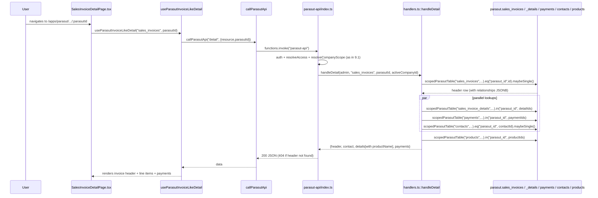

# ERP Backend Request Flow Architecture

This document maps how `/apps/*` (the ERP frontend) reaches the Supabase
backend: which frontend files call what, which Edge Functions exist, how
tenant scoping and authorization are enforced, and where writes happen. It
covers the **request flow**, not full column-level schema (that lives in
`supabase/migrations/**`, documented separately).

All file paths are relative to the repo root
`C:\Users\Bediz\Documents\dayandisli.com`.

---

## 1. High-level map

Two backend access patterns coexist in this codebase:

1. **Direct PostgREST access** — most of the "core ERP" domain (CRM, sales,
   inventory, production, HR, platform/automation, notifications, audit
   logs, companies) goes straight from the browser to Supabase PostgREST via
   `src/integrations/supabase/client.ts`, protected by Postgres RLS. This is
   the `src/features/erp/shared/erpApi.ts` + `src/features/erp/shared/api/*`
   family.
2. **Edge-Function-mediated access** — the Paraşüt mirror data (`parasut`
   Postgres schema) is **not** exposed via PostgREST at all (RLS revokes
   `anon`/`authenticated`, and the schema isn't in the exposed-schema list).
   The only way the browser reaches it is through two narrow Edge Functions:
   `parasut-api` (read-only) and `parasut-write-api` (the only function
   allowed to write to Paraşüt / trigger a sync). Market data (currency,
   gold, weather) is a third, unauthenticated, non-tenant Edge Function
   (`market-data`) since it holds no sensitive/tenant data.

There are also standalone Edge Functions for commerce checkout, payments,
notification dispatch, and outbound email — each independent, not part of
the Paraşüt flow.

```
Browser (React SPA, /apps/*)
 │
 ├── PostgREST direct path (RLS-enforced)
 │     src/integrations/supabase/client.ts (anon/publishable key + user JWT)
 │       → src/features/erp/shared/erpApi.ts, api/{crmApi,salesApi,inventoryApi,productionApi}.ts
 │       → supabase.from("<table>")... (public schema tables)
 │
 └── Edge Function path (service-role, RLS bypassed deliberately, scoped in app code)
       supabase.functions.invoke("parasut-api" | "parasut-write-api" | "market-data" | ...)
         → Deno edge function (index.ts) — verifies JWT, resolves erp_users row,
           resolves company scope, dispatches on `action`
         → handlers.ts (pure, unit-tested business logic)
         → admin.schema("parasut").from(<table>)... (service role, company_id filter forced)
         → sanitized JSON response
```

---

## 2. Frontend layers

### 2.1 Supabase client setup
`src/integrations/supabase/client.ts`
- Reads `VITE_SUPABASE_URL` / `VITE_SUPABASE_PUBLISHABLE_KEY` (anon key).
- `persistSession: true`, `autoRefreshToken: true`, session stored in
  `localStorage`.
- If env vars are missing, exports a `Proxy` that throws on any use
  (`createDisabledSupabaseClient`) instead of silently failing.

### 2.2 Auth resolution
`src/features/erp/shared/auth.ts`
- `resolveERPUserForAuthUser(user)`: looks up `public.erp_users` first by
  `auth_user_id = user.id`, and if not linked, falls back to matching by
  lowercased `email` with `auth_user_id IS NULL` (a "claim your bootstrap
  row" pattern for first login). Requires `is_active = true` in both cases.
- `getCurrentERPUser()` (in `erpApi.ts`) wraps this: `supabase.auth.getUser()`
  → `resolveERPUserForAuthUser`.

### 2.3 Core ERP API client — direct PostgREST
`src/features/erp/shared/erpApi.ts` (~3480 lines) re-exports from and adds to:
- `src/features/erp/shared/api/crmApi.ts` — stakeholders, CRM leads/opportunities/activities/tasks
- `src/features/erp/shared/api/salesApi.ts` — quotations, sales orders/items
- `src/features/erp/shared/api/inventoryApi.ts` — items, movements, warehouses
- `src/features/erp/shared/api/productionApi.ts` — routes, work orders, subcontracting
- `src/features/erp/shared/api/internal.ts` — shared helpers: `resolveEnterpriseScope`,
  `applyEnterpriseScope`, `withEnterpriseOwnership`, `createAuditLog`,
  `getNextERPNumber`, `success`/`failure` result wrappers, `isMissingTableError`

Pattern used throughout `erpApi.ts` for every list/read function (e.g.
`listAuditLogs`, `listPlatformMetrics`, `listCompanies`, `listNotifications`):
```ts
supabase.from("<table>" as never).select("*")...eq(...).order(...).limit(...)
```
Every table is accessed with `as never` casts — meaning these tables are
**not present in the generated `Database` types** (`src/integrations/supabase/types.ts`),
so type safety is opted out of at the call site. `ApiResult<T>` wraps
`{ data, error, missingTable?, demoFallback? }`; a missing table falls back
to `getDemoDatabaseStatus()` demo data (`src/features/erp/shared/demoFallback.ts`).

**Tenant scoping on the direct-PostgREST path**: `EnterpriseQueryScope` /
`resolveEnterpriseScope` / `applyEnterpriseScope` (in `api/internal.ts`)
apply `company_id`/`branch_id` filters at the query-builder level for
platform tables (`platform_metrics`, `platform_events`, `platform_alerts`,
`scheduled_job_runs`, `automation_rules`, `automation_executions`).
**This is application-code scoping, not RLS** — enforcement quality depends
on every call site actually calling `applyEnterpriseScope`; e.g.
`listCompanies()`, `listBranches()`, `listAuditLogs()`, `listNotifications()`
run with **no scope filter at all** and rely entirely on Postgres RLS
policies (not reviewed in this doc — see `supabase/migrations/**`).

**Writes on the direct-PostgREST path** are NOT separated into their own
files/modules — `erpApi.ts` freely mixes `insert`/`update` calls
(`createCompany`, `updateCompany`, `createPlatformAlert`,
`acknowledgePlatformAlert`, `createNotification`, `markNotificationRead`,
etc.) alongside `list*` reads in the same file, each function individually
responsible for calling `createAuditLog(...)` afterward. There is no
enforced "write path is isolated from read path" convention here — unlike
the Paraşüt module (see §3).

### 2.4 Paraşüt module — Edge-Function-mediated
`src/features/erp/parasut/api/client.ts` — `callParasutApi(action, params)`:
calls `supabase.functions.invoke("parasut-api", { body: { action, ...params } })`.
Comment in the file states explicitly: *"No write actions exist on this
client; the edge function itself has no insert/update/delete code path
either."*

`src/features/erp/parasut/api/write-client.ts` — `callParasutWriteApi(action, params)`:
calls `supabase.functions.invoke("parasut-write-api", ...)`. Deliberately a
**separate** client/function from the read path. Contains a documented
workaround for supabase-js swallowing edge function error bodies
(`extractServerErrorMessage` reads `error.context` as a `Response` and
parses its JSON, since `error.message` is always the generic
"non-2xx status" string).

`src/features/erp/parasut/api/queries.ts` — TanStack Query hooks, all built
on `callParasutApi`:

| Hook | Query key | Action | Notes |
|---|---|---|---|
| `useParasutDashboard()` | `["parasut","dashboard"]` | `dashboard` | |
| `useParasutList(resource, params)` | `["parasut","list",resource,params]` | `list` | `placeholderData: previous` (keeps old page while refetching) |
| `useParasutInvoiceLikeDetail(resource, id)` | `["parasut","detail",resource,id]` | `detail` | resource ∈ {sales_invoices, purchase_bills} |
| `useParasutContactDetail(resource, id)` | same | `detail` | resource ∈ {customers, suppliers} |
| `useParasutSimpleDetail(resource, id)` | same | `detail` | resource ∈ {products, accounts, payments} |
| `useParasutSyncRunDetail(runId)` | `["parasut","detail","sync_runs",runId]` | `detail` (resource: sync_runs) | |
| `useParasutReports()` | `["parasut","reports"]` | `reports` | |
| `useParasutSyncStatus(params)` | `["parasut","sync-status",params]` | `sync-status` | |

All use `staleTime: 60_000` (mirrored data only changes when a sync job
runs) and detail hooks use `enabled: Boolean(id)`. **No `invalidateQueries`
calls exist for this module** — because there is no client-driven mutation
path deployed yet (`parasut-write-api`'s `create-customer`/`resync` are not
wired into these query hooks in the reviewed files; the write client exists
but isn't yet visibly consumed by a mutation hook in `queries.ts`).

Pages consuming these hooks: `src/features/erp/parasut/pages/*.tsx`
(`DashboardPage`, `AccountsPage`/`AccountDetailPage`,
`ContactListPage`/`ContactDetailPage`, `CustomersPage`, `SuppliersPage`,
`SalesInvoicesPage`/`SalesInvoiceDetailPage`,
`PurchaseBillsPage`/`PurchaseBillDetailPage`, `ProductsPage`/`ProductDetailPage`,
`PaymentsListPage`, `PaymentsOutPage`, `ReportsPage`, `SyncPage`,
`SyncRunDetailPage`, and the generic `DomainResourcePage` which drives ~17
more resource list pages — sales offers, bank fees, taxes, transactions,
inventory levels/movements, shipment docs, item categories, employees,
salaries, e-invoices/e-archives/e-smm/inboxes, trackable jobs — via a config
table in `src/features/erp/parasut/navigation.ts`-adjacent
`DomainResourcePage.tsx`).

`ParasutListPage.tsx` (shared list-page component) owns pagination/search
UI state via **URL search params** (`?q=`, `?page=`, `?size=`), debounces
search input 300ms, and feeds `{ page, pageSize, search, filters }` into
`useParasutList`.

### 2.5 Permissions & routing
`src/features/erp/shared/permissions.ts`
- `PERMISSION_CATALOG`, `ROLE_DEFINITIONS`, `FOUNDATION_ROLE_PERMISSION_MAP`
  define role→permission mapping client-side (used for UI gating, not the
  source of truth — the Edge Functions re-derive permissions server-side
  independently from the same `erp_users.role`/`roles`/`permissions` data).
- `hasPermission(user, permission)`: `admin` role always passes; otherwise
  checks `getUserPermissions(user)`.
- `getRequiredPermissionForPath(pathname)`: regex table mapping routes to
  required permission, e.g. `/apps/parasut/senkronizasyon` →
  `parasut.sync.view`, `/apps/parasut/*` → `parasut.view`.
- `OUTBOUND_WRITE_ONLY_PERMISSIONS = ["accounting.contacts.create", "accounting.outbound.view"]`
  is explicitly excluded from the `finance` role's permission set (the write
  path requires an explicit grant or admin, not just "being finance").

---

## 3. Edge Functions inventory (`supabase/functions/**`)

| Function | Auth | Purpose | Reads | Writes |
|---|---|---|---|---|
| `parasut-api` | JWT required, `erp_users` lookup, `parasut.view`/`parasut.sync.view` permission | Read-only aggregation/list/detail for the Paraşüt mirror | `parasut.*` mirror tables | none (enforced structurally — no insert/update/delete anywhere in `handlers.ts`, and `ScopedQuery`/`SelectableTable` interfaces don't even expose those methods) |
| `parasut-write-api` | JWT required, `erp_users` lookup, `accounting.contacts.create` or admin | The **only** function allowed to write to Paraşüt (create customer) and the only one allowed to trigger a manual per-resource sync (`resync`, admin-only) | `parasut.*` (via `resync`/sync engine), `accounting_outbound_*` tables | Paraşüt HTTP write (create contact) + local outbound-command bookkeeping tables. **Comment in `index.ts` states this function is NOT YET DEPLOYED** — its dependent tables (`accounting_outbound_commands/_attempts/_provider_links/_audit_log`) don't exist in production yet |
| `market-data` | **None** — public, unauthenticated GET | Aggregates currency (Frankfurter/TCMB), gold (MetalpriceAPI), weather (Tomorrow.io) for the dashboard cards | 3 external HTTP APIs, no DB access at all | none |
| `commerce-checkout` | JWT (`authClient.auth.getUser`) | Shop checkout: creates order, reserves inventory, rolls back on failure | `products`, `orders`, `inventory_items`, `shop_customer_profiles` | `orders`, `order_items`, `inventory_items`, `shop_inventory_reservations`, `commerce_checkout_events`, and rollback deletes on `orders`/`sales_orders` |
| `notification-dispatch` | **No JWT check visible** — pulls all `status = 'pending'` rows and dispatches | Sends queued customer notifications via provider | `shop_customer_notifications` joined with `orders` | updates `shop_customer_notifications.status` to sent/failed |
| `payment-create` | JWT (`userClient.auth.getUser`) | Initiates a payment with a provider for an order | `orders`, `shop_payment_statuses` | `orders`, `payment_provider_events`, `payment_provider_health` |
| `payment-refund` | JWT + `erp_users` role check | Issues a refund | `erp_users`, presumably `orders`/payment tables | `payment_refund_operations` |
| `payment-webhook` | Provider signature-based (not a Supabase user JWT) | Receives payment provider webhook callbacks | `payment_provider_events`, `orders` | `orders`, `shop_payment_statuses`, `payment_provider_events`, `payment_refund_operations`, `payment_provider_health` |
| `send-contact-email` | none reviewed (`Deno.serve` directly, minimal grep hits) | Sends the public contact-form email | — | (email provider only, no DB writes found) |
| `send-quotation-email` | none reviewed | Sends a quotation email | — | (email provider only) |
| `parasut-sync` | **None — no auth check at all** | Legacy OAuth token-exchange callback for Paraşüt | — | `parasut_tokens` (a **different, legacy** table than the `parasut.*` mirror schema) |
| `parasut-sync-run` | **None — no auth check at all** | Legacy full-resync cron/manual trigger; fetches contacts/products/sales_invoices directly from Paraşüt REST API with manual pagination/rate-limit retry | Paraşüt REST API | `parasut_contacts`, `parasut_products`, `parasut_invoices` (again, **legacy tables distinct from the current `parasut.*` schema** used by `parasut-api`/`parasut-write-api`) |

### Shared helper modules (`supabase/functions/_shared/`)
- `company-scope.ts` — pure, dependency-free `resolveCompanyScope(user, requestedCompanyId)`. See §4.
- `parasut-metrics.ts` — pure aggregation math (aging reports, monthly trends, VAT estimates) over mirror rows.
- `accounting-outbound-repository.ts` — repository classes for the not-yet-deployed outbound write tables.

**Concerning finding**: `parasut-sync` and `parasut-sync-run` are legacy,
**completely unauthenticated** Edge Functions (no JWT/user check anywhere)
that write to a *different* set of Paraşüt-mirroring tables
(`parasut_tokens`, `parasut_contacts`, `parasut_products`,
`parasut_invoices`) than the current, properly-scoped `parasut.*` schema
used everywhere else. They appear to predate the `parasut`-schema
architecture and are not referenced by any frontend code found in
`src/features/erp/parasut/**`. If still deployed, they represent an
unauthenticated public write surface and a parallel, likely-stale data
model. Worth confirming whether they're still deployed/scheduled or dead
code slated for removal.

---

## 4. Authentication, tenant scoping, authorization (Edge Function path)

Both `parasut-api` and `parasut-write-api` follow the identical pattern in
their `index.ts`:

1. Extract `Authorization: Bearer <token>` header.
2. `userClient.auth.getUser(token)` (anon-key client, just for JWT
   verification) → gets `email` + `user.id`. 401 if missing.
3. Build a **service-role** `admin` client (`SUPABASE_SERVICE_ROLE_KEY`) —
   this is what actually reads `parasut.*` (RLS-bypassing), so all tenant
   isolation from here on is **application code**, not RLS.
4. `resolveAccess(admin, authUserId, email, requestedCompanyId)`:
   - Looks up `public.erp_users` by `auth_user_id` first, falling back to
     `email` match with `auth_user_id IS NULL` (bootstrap-claim pattern,
     mirrors `src/features/erp/shared/auth.ts`). This is the **only**
     unscoped `erp_users` query in the whole function (documented as the
     deliberate exception, since it's the authz lookup itself).
   - Computes `canViewParasut` / `hasCreatePermission` / `isAdmin` from
     `role`, `roles[]`, `permissions[]` columns — logic duplicated (by
     necessity, server can't trust client) from
     `src/features/erp/shared/permissions.ts`.
   - Calls `resolveCompanyScope(authzRow, requestedCompanyId)` from
     `_shared/company-scope.ts`.
5. `resolveCompanyScope` (pure function, unit-tested):
   - Normalizes `accessible_company_ids` (dedupe + lowercase UUIDs).
   - No accessible companies → reject.
   - `requestedCompanyId` given but not a valid UUID, or not in the user's
     accessible list → reject (case-insensitive compare, but the request
     value must still itself be validated as UUID first).
   - No `requestedCompanyId` + exactly 1 accessible company → auto-select.
   - No `requestedCompanyId` + >1 accessible companies → reject (must
     disambiguate explicitly; **no implicit "all companies" scope, even for
     admin**).
6. Every subsequent DB read is forced through `scopedParasutTable` /
   `scopedSyncTable` (`parasut-api/handlers.ts`), which call
   `.schema("parasut").from(table).select(columns).eq("company_id", activeCompanyId)`
   as one atomic chain — there's no code path in `handlers.ts` that reaches
   `parasut.*` without that `.eq("company_id", ...)` immediately applied
   (enforced by the test suite `handlers.test.ts`, per the file's own
   comments).

Permission matrix (from `parasut-api/index.ts` comments, cross-checked
against `permissions.ts`):
- `parasut.view` — admin, OR role `finance`, OR explicit `parasut.view`
  permission, OR `system.manage`.
- `parasut.sync.view` — admin, OR `system.manage`, OR explicit
  `parasut.sync.view` permission. **`finance` role alone does NOT grant
  this** (deliberately excluded in `permissions.ts`).
- `accounting.contacts.create` (write path) — admin, OR explicit
  `accounting.contacts.create`, OR `system.manage`. `finance` role alone
  does **not** grant this either (`OUTBOUND_WRITE_ONLY_PERMISSIONS`).
- Manual "resync" trigger — strictly `access.isAdmin` (role-based, narrower
  than `hasCreatePermission`).

Feature flag: `ACCOUNTING_WRITE_ENABLED` env var gates the `create-customer`
action entirely (checked in `parasut-write-api/handlers.ts`'s
`assertCreateCustomerAllowed`, in a fixed order: permission → feature flag →
provider capability, so the client always learns the *first* blocking
reason).

---

## 5. Pagination, filtering, sorting conventions

**Paraşüt list resources** (`parasut-api/handlers.ts::handleList`):
- `page`/`pageSize` clamped via `clampPage`/`clampPageSize` (default page
  size 25, max 100).
- Offset pagination: `.range(from, to)` where `from = (page-1)*pageSize`.
- `count: "exact"` requested on every list query → total returned to client
  for page-count computation.
- Search: per-resource allow-listed columns, combined via PostgREST
  `.or("col1.ilike.%term%,col2.ilike.%term%")`; `%`/`,` characters stripped
  from user input before interpolation (basic PostgREST-filter-injection
  guard).
- Sort: client-supplied `sort.field` is validated against an explicit
  per-resource allow-list (`typedConfig.fields.includes(sortField)` or, for
  the untyped/JSONB resources, always sorts on
  `attributes->>${sortField}` — **no allow-list on the untyped path**,
  meaning any string the client sends becomes a JSON path expression in the
  `order()` call; this is a milder injection surface worth checking against
  PostgREST's own column-name escaping since it's not raw SQL, but it is
  looser than the typed-resource path).
- Filters: hand-coded per resource (`archived`, `currency`, `dueFrom/dueTo`,
  `status`, `onlyOpen`) — an explicit allow-list of supported filter keys,
  not a generic passthrough.

**Direct-PostgREST core ERP path** (`erpApi.ts`): mostly `.limit(n)` with a
fixed default (e.g. 100, 200) and `.order("created_at", {ascending:false})`;
no `count`/offset pagination pattern observed in the reviewed portion — these
read as "recent N rows" style lists rather than true paged lists.

---

## 6. `raw_payload` / JSONB fallback handling

Mirror tables carry a `raw_payload` JSONB column (the full captured Paraşüt
API response) alongside promoted, typed columns for the "typed" resources
(`TYPED_RESOURCE_CONFIG` in `parasut-api/handlers.ts`: sales_offers,
bank_fees, taxes, transactions, inventory_levels, stock_movements,
shipment_documents, item_categories, employees, salaries, e_invoices,
e_invoice_inboxes, e_archives, e_smms, trackable_jobs).

`normalizeTypedRecord` builds each field as
`row[field] ?? fallback[field] ?? null`, where `fallback` is
`raw_payload.attributes` (or `raw_payload` itself if no nested
`attributes`) — i.e. **`raw_payload` is read server-side as a fallback
source for individual fields, but the raw JSONB blob itself is selected
from the DB** (it's in `baseColumns` for typed queries) **and only
discarded when building the final normalized row returned to the client**
(`normalizeTypedRecord` returns a fixed, whitelisted `attributes` object —
`raw_payload` is not included in the returned shape). So: `raw_payload` is
fetched server-side but not forwarded to the browser for typed resources —
good practice. For the *untyped* resources (customers/suppliers, products,
sales_invoices, purchase_bills, accounts, payments), the column selection
(`LIST_SELECT_COLUMNS`) explicitly lists `attributes, relationships,
source_created_at, ...` and does **not** include `raw_payload` at all, so it
is never queried or returned for those either, for **list** responses.

**Caveat found on re-review**: `handleDetail` (`parasut-api/handlers.ts:455-519`) does **not**
reuse `LIST_SELECT_COLUMNS`/`baseColumns` — every detail lookup selects `"*"` instead of an
explicit column list: the `sales_invoices`/`purchase_bills` header row
(`scopedParasutTable(admin, resource, activeCompanyId, "*")`, handlers.ts:457), its `details`/
`payments` children (handlers.ts:469-470), the `contacts` row for customers/suppliers
(handlers.ts:490, 495), and the `products`/`accounts`/`payments` single-record lookup
(handlers.ts:504). If any of those tables has a `raw_payload` (or other non-whitelisted) column —
plausible, since the typed-resource *list* path explicitly reads `raw_payload` off tables in the
same schema — it would be returned verbatim in every **detail** page response, unlike list pages.
This was not confirmed against a live schema dump; recommend verifying column-by-column against
the migrations in `supabase/migrations/**` (e.g. `20260723103525_parasut_full_apidocs_schema_expansion.sql`)
and, if `raw_payload` is present, tightening these `select("*")` calls to explicit column lists
the same way `LIST_SELECT_COLUMNS` already does for list resources.

---

## 7. Sync / reconciliation logic

- **Current architecture**: `parasut-write-api`'s `resync` action (admin
  only) calls one of `syncContacts`/`syncProducts`/`syncAccounts`/
  `syncSalesInvoices`/`syncPurchaseBills` from `server/parasut/sync-*.ts`,
  passing `{ concurrencyLock: true }`. Mutual exclusion is enforced inside
  `syncCollection` itself via a race-free "post-insert election"
  (`enforceSingleRunner`, referenced in `server/parasut/sync-base.ts`, not
  read in this pass) rather than a separate check-then-act query in the
  Edge Function — a lost election surfaces as `SyncAlreadyRunningError` →
  HTTP 409 to the client.
- Deletion reconciliation: contacts deleted in Paraşüt are marked
  `source_archived = true` by the mirror sync, never physically deleted
  (comment in `handleList`'s customers/suppliers case) — so normal list
  queries default to excluding archived rows (`source_archived.eq.false OR
  source_archived.is.null`), while an explicit `filters.archived === true`
  opts back in.
- Sync run history is queryable via `parasut-api`'s `sync-status` action and
  `sync_runs`/`sync_errors` tables (both scoped via `scopedSyncTable`),
  surfaced in `SyncPage.tsx`/`SyncRunDetailPage.tsx`.
- **Legacy/parallel path**: `parasut-sync` (OAuth callback) and
  `parasut-sync-run` (full manual resync with hand-rolled pagination/
  rate-limiting) write to a *different* set of tables
  (`parasut_tokens`/`parasut_contacts`/`parasut_products`/
  `parasut_invoices`) and have **no authentication at all** — see the
  concerning-findings note in §3.

---

## 8. Write confinement summary

| Domain | Write path | Isolated from reads? |
|---|---|---|
| Paraşüt mirror data | `parasut-write-api` only (`create-customer`, `resync`) | **Yes, strictly** — separate Edge Function, separate frontend client (`write-client.ts` vs `client.ts`), `parasut-api` has zero insert/update/delete code paths (enforced by its own type interfaces + a dedicated test asserting this), and a code comment/test cross-references the invariant on both sides |
| Core ERP (companies, platform metrics/events/alerts, notifications, automation) | Inline `insert`/`update` functions mixed into `erpApi.ts` alongside reads | **No** — same file, same module, no dedicated write-only client or Edge Function boundary; relies on Postgres RLS + `applyEnterpriseScope`/`withEnterpriseOwnership` helpers being called correctly at each site |
| Commerce checkout / payments | Dedicated Edge Functions per concern (`commerce-checkout`, `payment-create`, `payment-refund`, `payment-webhook`) | Partially — each function is its own boundary, but each also both reads and writes within itself (e.g. `commerce-checkout` reads `products`/`inventory_items` then writes `orders`/reservations in the same function) |
| Legacy Paraşüt sync (`parasut-sync`, `parasut-sync-run`) | Direct table upserts, unauthenticated | **No isolation and no auth** — flagged as a concern above |

---

## 9. Representative flows

### 9.1 List page load — e.g. `SalesInvoicesPage` (Paraşüt module)



### 9.2 Detail page load — e.g. `SalesInvoiceDetailPage`



### 9.3 Write action — manual "Sync" button (admin-only resync)

```mermaid
sequenceDiagram
    participant U as Admin user
    participant Page as e.g. CustomersPage.tsx ("Sync" button)
    participant WClient as callParasutWriteApi (write-client.ts)
    participant EF as parasut-write-api/index.ts
    participant Engine as server/parasut/sync-contacts.ts (syncCollection)
    participant Provider as Paraşüt REST API
    participant DB as parasut.contacts (mirror) + sync_runs/sync_errors

    U->>Page: clicks "Senkronize Et"
    Page->>WClient: callParasutWriteApi("resync", {resource:"customers"})
    WClient->>EF: functions.invoke("parasut-write-api")
    EF->>EF: auth + resolveAccess (isAdmin required, not just hasCreatePermission)
    alt not admin
        EF-->>WClient: 403 {error: "ERP yöneticisi yetkisi gereklidir"}
    else admin, company scope ok
        EF->>Engine: syncContacts(context, {concurrencyLock:true})
        Engine->>DB: attempts to acquire single-runner election (insert to sync_runs)
        alt another sync already running
            Engine-->>EF: throws SyncAlreadyRunningError
            EF-->>WClient: 409 {error: "Bir senkronizasyon zaten devam ediyor."}
        else election won
            Engine->>Provider: paginated GET /contacts (via TokenManager/ParaşütClient)
            Provider-->>Engine: pages of contact records
            Engine->>DB: upsert parasut.contacts rows (company_id-scoped), archive missing rows
            Engine->>DB: write sync_runs/sync_errors summary
            Engine-->>EF: SyncResult{status,pages,observed,inserted,updated,unchanged,errors,reconciliation}
            EF-->>WClient: 200 JSON (ResyncContactsResponse)
        end
    end
    WClient-->>Page: result or thrown Error (server message extracted from error.context)
    Page-->>U: toast/status update; page then re-fetches via useParasutList (no explicit invalidateQueries observed in queries.ts — likely a manual refetch() call in the page component)
```

---

## 10. Notable findings / concerns

1. **`parasut-sync` and `parasut-sync-run` are unauthenticated Edge
   Functions** writing to a legacy table set (`parasut_tokens`,
   `parasut_contacts`, `parasut_products`, `parasut_invoices`) distinct from
   the current, properly tenant-scoped `parasut.*` schema. No JWT/user
   check exists in either file. If still deployed, this is an open write
   surface and a source of stale/duplicate data. Recommend confirming
   deployment status and likely deleting/deprecating.
2. **`notification-dispatch` has no visible auth check** — it processes all
   `status = 'pending'` rows in `shop_customer_notifications` on invocation.
   If it's meant to be invoked only by a scheduled/service-role trigger
   (not directly reachable from the browser with a user JWT), that should
   be confirmed and documented; as written, anyone who can invoke the
   function can trigger a dispatch pass.
3. **`raw_payload` is not exposed to the browser** in either the typed or
   untyped resource paths — confirmed by reading the exact column lists
   (`LIST_SELECT_COLUMNS`, `baseColumns` + `normalizeTypedRecord`'s returned
   shape). This is good practice and worth preserving in any future
   refactor.
4. **Read/write isolation is strict for the Paraşüt module**
   (`parasut-api` vs `parasut-write-api`, enforced by types + tests) but
   **not for the core ERP module** (`erpApi.ts` freely mixes reads and
   writes in one file with no structural boundary) — a real architectural
   asymmetry between the two subsystems in this codebase.
5. **Tenant scoping is real but only application-enforced past the RLS
   boundary** for Edge-Function paths — since these functions use the
   *service-role* key (RLS-bypassing) by design, correctness depends
   entirely on `scopedParasutTable`/`scopedSyncTable` being the only way to
   reach `parasut.*`, which is enforced by convention + a dedicated test
   suite rather than by the database itself. A future handler that forgot
   to use these helpers and called `admin.schema("parasut").from(...)`
   directly would silently break isolation with no DB-level backstop.
6. **Sort-field validation gap**: on the untyped resource list path
   (customers/suppliers/products/sales_invoices/purchase_bills/accounts/
   payments), `sortField` is interpolated directly into
   `attributes->>${sortField}` with no allow-list check (unlike the typed
   resource path, which validates against `typedConfig.fields`). Low
   severity (PostgREST still parses/escapes the resulting filter
   expression; this isn't raw SQL), but inconsistent with the stricter
   pattern used elsewhere in the same file.
7. **No `invalidateQueries` usage found** in `src/features/erp/parasut/api/queries.ts`
   for the resync/create-customer write paths — cache refresh after a write
   likely relies on manual `refetch()` calls at the page level (or simply
   the 60s `staleTime` expiring), not on React Query's mutation→invalidation
   convention. Worth confirming in the page components if immediate refresh
   after "Sync" is expected UX.
