# ERP Production JSX Hierarchy (`/apps/*`)

This document maps the actual, currently-shipping component tree behind every
production route under the `/apps/*` namespace. It intentionally excludes
`/demo/*` (`src/features/ebru-demo/**`), which is a separate, parallel demo
copy of the same UI and is never reachable from a real ERP session.

## 1. Layered architecture

```
BrowserRouter (src/App.tsx:157)
 └─ ERPAuthProvider (src/contexts/ERPAuthContext.tsx) — wraps the whole app, enabled = shouldExposeErpRoutes()
     └─ ERPErrorBoundary (src/components/ERPErrorBoundary.tsx)
         └─ AppRoutes (src/App.tsx:90) → <Routes>
             └─ Route path="/apps/*" element={protectedElement(<EbruPreviewPage />)}  (src/App.tsx:140)
                 └─ ProtectedRoute (src/components/ProtectedRoute.tsx) — auth gate, redirects to /login if unauthenticated
                     └─ EbruPreviewPage (src/features/ebru-preview/EbruPreviewPage.tsx:119)  ← THE canonical ERP shell
                         ├─ Sidebar / topbar / search / quick actions / calendar (inline JSX, same file)
                         ├─ useParasutDashboard() (src/features/erp/parasut/api/queries.ts:30) — dashboard KPIs/timeline
                         ├─ useMarketData() (src/features/market-data/useMarketData.ts) — FX/gold/weather widgets
                         └─ Route dispatch:
                             if routePath === "/apps" || "/apps/"  → inline dashboard JSX (same component, lines 835-989)
                             else → <Suspense><EbruRouteContent routePath={routePath} /></Suspense> (line 832)
                                 └─ EbruRouteContent (src/features/ebru-preview/EbruRouteContent.tsx:53)
                                     — a single function with a linear if/`routePath.endsWith(...)` chain
                                     (NOT React Router <Routes>, NOT applicationRegistry-driven)
                                     that returns one leaf page component per matched suffix.
                                     Falls through to <FinanceOverview /> (finance-preview/FinanceOverview.tsx:81)
                                     for any unmatched path (see §3 "silent fallback").
```

Other `/apps/*` branches registered ahead of the catch-all in `src/App.tsx`:

```
Route path="/apps/ebru-preview/*"  → protectedElement(<Navigate to="/apps" replace />)   (App.tsx:137)
Route path="/apps/parasut/*"       → protectedElement(<LegacyParasutRedirect />)          (App.tsx:138)
                                        └─ resolveLegacyParasutRoute() (App.tsx:71) rewrites the path
                                           via LEGACY_PARASUT_ROUTES (App.tsx:55-69) into an
                                           /apps/finance/... or /apps/hr/... URL, then <Navigate replace>.
                                           This NEVER renders src/features/erp/parasut/layout/ParasutLayout.tsx —
                                           that layout, ParasutSidebar, ParasutTopBar and the whole
                                           src/features/erp/parasut/pages/* tree are dead code in production;
                                           they are only imported by src/features/erp/parasut/index.tsx and
                                           src/features/erp/unified-shell/UnifiedErpShellContext.tsx, neither of
                                           which is imported anywhere reachable from /apps/*.
```

**`applicationRegistry.ts` is not part of the routing chain.** `src/features/erp/apps/applicationRegistry.ts`
(`erpApplications[]`) is imported by exactly one production file, `src/features/erp/shared/permissions.ts:1`
(to build the permission catalog, `permissions.ts:38-41`) plus its own tests. It is never imported by
`EbruPreviewPage.tsx`, `EbruRouteContent.tsx`, or any nav component, so its `module.route` suffixes do **not**
describe what actually renders — the real dispatch table is the if-chain in `EbruRouteContent.tsx`.

**`UnifiedErpShellContext` is not the production shell.** It is only referenced by the (unreachable) Paraşüt
layout files. `EbruPreviewPage.tsx` implements its own sidebar/topbar/search directly — it does not consume
`UnifiedErpShellContext`.

## 2. Permission gate

`ProtectedRoute` only checks authentication, not per-route permission. Per-route/per-module permission
resolution lives in `src/features/erp/shared/permissions.ts`:

- `getRequiredPermissionForPath(pathname)` (`permissions.ts:256`) — regex table `ROUTE_PERMISSIONS`
  (`permissions.ts:213-254`) maps a path prefix to a permission key (e.g. `/apps/finance` → `finance.view`? — actually no direct `/apps/finance` entry; falls through to the "strip `/apps`" retry at `permissions.ts:268-272`, then matches `^\/finans|^\/finance...` → `finance.view`).
- `hasPermission(user, permission)` (`permissions.ts:165`) — `admin` role always passes; otherwise checks
  `getUserPermissions(user)` built from `FOUNDATION_ROLE_PERMISSION_MAP` (`permissions.ts:135-146`).
- **This function is not called from `EbruPreviewPage.tsx` or `EbruRouteContent.tsx`.** Neither file imports
  `permissions.ts`. No production route component under `/apps/*` (outside `ProtectedRoute`'s auth check)
  currently calls `getRequiredPermissionForPath` / `hasPermission` to gate rendering. The permission catalog
  and role maps exist and are unit-tested (`permissions.test.ts`), but are not wired into the live route tree —
  any authenticated user who reaches `/apps/*` can view every page `EbruRouteContent` can render, regardless
  of role. (The one exception: `CanonicalParasutPages.tsx:112` — `SyncButton` — checks `roles.includes("admin")`
  client-side before showing the "Senkronize Et" button.)

## 3. Route family trees

### 3.1 Dashboard root

```
/apps  or  /apps/
└── ProtectedRoute
    └── EbruPreviewPage (EbruPreviewPage.tsx:119)
        └── inline dashboard JSX (EbruPreviewPage.tsx:835-989)
            ├── useParasutDashboard() → src/features/erp/parasut/api/queries.ts:30
            │     └── GET via src/features/erp/parasut/api/client.ts → supabase function `parasut-api`
            ├── useMarketData() → src/features/market-data/useMarketData.ts
            │     └── supabase/functions/market-data (handlers.ts) — FX/gold/weather providers
            └── DonutCard (local component, EbruPreviewPage.tsx:1045)
```

### 3.2 Finance overview

```
/apps/finance  or  /apps/finance/
└── EbruPreviewPage → EbruRouteContent (no suffix match) → <FinanceOverview />
    (src/features/ebru-preview/finance-preview/FinanceOverview.tsx:81)
    — renders financeOverviewData static placeholder object (financePreviewData.ts:167-212),
      NOT a live query. All values are literal "—" placeholders. Read-only, no backend call.
```

### 3.3 Finance / Income (Gelir Yönetimi)

```
/apps/finance/income/invoices
└── EbruRouteContent.tsx:86 → <InvoiceListPage /> (finance-preview/FinanceIncomePages.tsx:159)

/apps/finance/income/invoices/new
└── EbruRouteContent.tsx:85 → <SalesInvoiceForm /> (finance-preview/FinanceInvoicePages.tsx:11)

/apps/finance/income/customers
└── EbruRouteContent.tsx:88 → <CustomerListPage /> (finance-preview/FinanceIncomePages.tsx:286)

/apps/finance/income/customers/new
└── EbruRouteContent.tsx:87 → <CustomerFormPage /> (finance-preview/FinanceIncomePages.tsx:390)

/apps/finance/income/collection-report
└── EbruRouteContent.tsx:89 (and :69 for /reports/collections) → <CollectionReportPage />
    (finance-preview/FinanceIncomePages.tsx:538)
```
All five pull rows via `useParasutList` / `useParasutReports`
(`src/features/erp/parasut/api/queries.ts:42`, `:107`) → `src/features/erp/parasut/api/client.ts` →
Supabase Edge Function `parasut-api` (mirrors Paraşüt data). Live data (Y). Writes (invoice/customer
create) go through `src/features/erp/parasut/api/write-client.ts` → Edge Function `parasut-write-api`.

### 3.4 Finance / Expenses (Gider Yönetimi)

```
/apps/finance/expense/list                      → EbruRouteContent.tsx:96  → <ExpenseListPage />        (FinanceExpensePages.tsx:170)
/apps/finance/expense/list/new/invoice           → EbruRouteContent.tsx:90  → <ExpenseInvoicePage />      (FinanceExpensePages.tsx:421)
/apps/finance/expense/list/new/payroll           → EbruRouteContent.tsx:91  → <SimpleExpenseForm type="payroll" /> (FinanceExpensePages.tsx:515)
/apps/finance/expense/list/new/tax               → EbruRouteContent.tsx:92  → <SimpleExpenseForm type="tax" />
/apps/finance/expense/list/new/bank-expense      → EbruRouteContent.tsx:93  → <SimpleExpenseForm type="bank" />
/apps/finance/expense/list/new/other             → EbruRouteContent.tsx:94  → <SimpleExpenseForm type="other" />
/apps/finance/expense/list/new/accommodation     → EbruRouteContent.tsx:95  → <ExpenseInvoicePage accommodation />
/apps/finance/expense/incoming-invoices          → EbruRouteContent.tsx:97  → <IncomingInvoicesPage />   (FinanceExpensePages.tsx:273)
/apps/finance/expense/income-expense-report      → EbruRouteContent.tsx:98  → <IncomeExpenseReportPage /> (FinanceReportPages.tsx:145)
/apps/finance/expense/payments-report            → EbruRouteContent.tsx:99  → <PaymentsReportPage />      (FinanceReportPages.tsx:212)
/apps/finance/expense/vat-report                 → EbruRouteContent.tsx:100 → <VatReportPage />            (FinanceReportPages.tsx:254)
```
All use `useParasutList` / `useParasutReports` against Paraşüt-mirrored Supabase tables (live). Forms write
through `write-client.ts`.

### 3.5 Finance / Inventory (Stok Yönetimi)

```
/apps/finance/inventory/products                  → EbruRouteContent.tsx:102 → <ProductsPage />          (OperationsPages.tsx:134)
/apps/finance/inventory/products/new               → EbruRouteContent.tsx:101 → <ProductFormPage />        (OperationsPages.tsx:158)
/apps/finance/inventory/outgoing-dispatches         → EbruRouteContent.tsx:105 → <DispatchesPage type="outgoing" /> (OperationsPages.tsx:271)
/apps/finance/inventory/incoming-dispatches         → EbruRouteContent.tsx:106 → <DispatchesPage type="incoming" />
/apps/finance/inventory/outgoing-dispatches/new     → EbruRouteContent.tsx:103 → <DispatchFormPage type="outgoing" /> (OperationsPages.tsx:298)
/apps/finance/inventory/incoming-dispatches/new     → EbruRouteContent.tsx:104 → <DispatchFormPage type="incoming" />
/apps/finance/inventory/history                     → EbruRouteContent.tsx:107 → <StockHistoryPage />      (OperationsPages.tsx:384)
/apps/finance/inventory/report                      → EbruRouteContent.tsx:108 → <StockReportPage />       (OperationsPages.tsx:401)
```
Data source: Paraşüt-mirrored `products` / `stock_movements` / `inventory_levels` / `shipment_documents`
resources via `useParasutList`. Live.

### 3.6 Finance / Purchasing & Cash

```
/apps/finance/purchasing/suppliers        → EbruRouteContent.tsx:110 → <SuppliersPage />  (OperationsPages.tsx:456)
/apps/finance/purchasing/suppliers/new    → EbruRouteContent.tsx:109 → <SupplierFormPage /> (OperationsPages.tsx:477)
/apps/finance/purchasing/orders           → EbruRouteContent.tsx:112 → <OrdersPage />      (OperationsPages.tsx:520)
/apps/finance/purchasing/orders/new       → EbruRouteContent.tsx:111 → <OrderFormPage />   (OperationsPages.tsx:541)
/apps/finance/cash/accounts               → EbruRouteContent.tsx:115 → <CashAccountsPage /> (FinanceReportPages.tsx:322)
/apps/finance/cash/checks                 → EbruRouteContent.tsx:114 → <ChecksPage />       (FinanceReportPages.tsx:357)
/apps/finance/cash/checks/new             → EbruRouteContent.tsx:113 → <CheckFormPage />    (OperationsPages.tsx:622)
/apps/finance/cash/cash-bank-report       → EbruRouteContent.tsx:116 → <CashBankReportPage /> (FinanceReportPages.tsx:387)
/apps/finance/cash/cash-flow-report       → EbruRouteContent.tsx:117 → <CashFlowReportPage /> (FinanceReportPages.tsx:444)
```
Note: `/apps/finance/purchasing/suppliers` (rendered here) is a **duplicate implementation** of the supplier
list also reachable pre-migration at `/apps/parasut/alislar/tedarikciler`, which `LegacyParasutRedirect`
(App.tsx:76) now rewrites to `/apps/finance/purchasing/suppliers` — so there is only one live target, but two
disjoint code paths *could* reach it (direct nav vs. legacy redirect); both land on `OperationsPages.tsx:456`,
not on `src/features/erp/parasut/pages/SuppliersPage.tsx` (which is unreachable — see §1).

### 3.7 CRM

```
/apps/crm/customers               → EbruRouteContent.tsx:84 → <CrmCustomerListPage /> (crm-preview/CustomerListPage.tsx:28)
/apps/crm/customers/new           → EbruRouteContent.tsx:81 → <CrmCustomerFormPage />  (crm-preview/CustomerFormPage.tsx:5)
/apps/crm/customers/:id/edit      → EbruRouteContent.tsx:82 → <CrmCustomerFormPage edit /> (same file)
/apps/crm/customers/:id           → EbruRouteContent.tsx:83 → <CustomerDetailPage />   (crm-preview/CustomerDetailPage.tsx:19)
```
`CustomerListPage` renders `crmCustomers` (`crm-preview/crmCustomerData.ts:3`), a **hard-coded empty array**
(`export const crmCustomers: CrmCustomer[] = [];`) — this page always shows an empty state; it is not wired
to `useParasutList("customers", …)` even though `finance/income/customers` (§3.3) shows real Paraşüt customer
data at a near-identical URL shape. This is a duplicate-of-another-route case with divergent data sources
(one live, one permanently empty).

### 3.8 Sales

```
/apps/sales/quotes                          → EbruRouteContent.tsx:77 → <QuotesPage />        (sales-preview/SalesListPages.tsx:87)
/apps/sales/quotes/new                      → EbruRouteContent.tsx:74 → <QuoteFormPage />      (sales-preview/QuotePages.tsx:31)
/apps/sales/quotes/:id/edit                 → EbruRouteContent.tsx:74 → <QuoteFormPage />
/apps/sales/quotes/:id                      → EbruRouteContent.tsx:76 → <QuoteDetailPage />    (sales-preview/QuotePages.tsx:353)
/apps/sales/quotes/:id/print  (any /print)  → EbruRouteContent.tsx:75 → <QuotePrintPage />     (sales-preview/pdf/QuotePrintPage.tsx:8)
                                                  └─ <QuoteDocument /> (sales-preview/pdf/QuoteDocument.tsx:9)
/apps/sales/orders                          → EbruRouteContent.tsx:79 → <SalesOrdersPage />    (sales-preview/SalesListPages.tsx:178)
/apps/sales/orders/new                      → EbruRouteContent.tsx:78 → <SalesOrderFormPage /> (sales-preview/QuotePages.tsx:496)
/apps/sales/activities                      → EbruRouteContent.tsx:80 (any other /sales/* path) → <SalesActivitiesPage /> (sales-preview/SalesListPages.tsx:214)
```
Backed by `useParasutList("sales_offers", …)` — live Paraşüt-mirrored quotes; sales "orders"/"activities" are
UI-only groupings over the same/adjacent data, not distinct backend resources.

### 3.9 Reports

```
/apps/reports/collections     → EbruRouteContent.tsx:69 → <CollectionReportPage />    (finance-preview/FinanceIncomePages.tsx:538) — SAME component as /apps/finance/income/collection-report
/apps/reports/income-expense  → EbruRouteContent.tsx:70 → <IncomeExpenseReportPage /> (finance-preview/FinanceReportPages.tsx:145) — SAME component as /apps/finance/expense/income-expense-report
/apps/reports/cash-bank       → EbruRouteContent.tsx:71 → <CashBankReportPage />      (finance-preview/FinanceReportPages.tsx:387) — SAME component as /apps/finance/cash/cash-bank-report
/apps/reports/production      → EbruRouteContent.tsx:72 → <ProductionReportPage />    (reports-preview/ProductionReportPage.tsx:38)
```
`/apps/reports/*` is a duplicate namespace: three of its four leaves are literally the same component
instances also mounted under `/apps/finance/...`. Only `production` is unique to `/apps/reports`.
`ProductionReportPage` is the sole page in the entire `/apps/*` tree that represents the "Üretim" (production)
domain with a real component — see §3.11 for the top-level `/apps/production` stub, which is different.

### 3.10 HR & E-Documents

```
/apps/hr  or  /apps/hr/employees   → EbruRouteContent.tsx:56-58 → <CanonicalParasutListPage config={canonicalParasutPages.employees} /> (finance-preview/CanonicalParasutPages.tsx:197, config at :86)
/apps/hr/salaries                  → EbruRouteContent.tsx:59-61 → <CanonicalParasutListPage config={canonicalParasutPages.salaries} />  (config at :87)
/apps/e-documents  or  /apps/e-documents/invoices → EbruRouteContent.tsx:62-67 → <CanonicalParasutListPage config={canonicalParasutPages.eInvoices} /> (config at :88)
```
`CanonicalParasutListPage` is a single generic, config-driven table renderer (`CanonicalParasutPages.tsx:197`)
backed by `useParasutList(config.resource, …)` (`parasut/api/queries.ts:42`) — a **generic adapter**, not a
resource-specific page component. Live data for `employees`/`salaries`/`e_invoices` Paraşüt resources.

### 3.11 Top-level app stubs (sidebar links with no `EbruRouteContent` match)

```
/apps/commerce, /apps/production, /apps/quality, /apps/website, /apps/settings,
/apps/maintenance, /apps/repair, /apps/purchasing, /apps/inventory,
/apps/accounting, /apps/invoicing, /apps/expenses
└── EbruPreviewPage → EbruRouteContent (no suffix matches any `if` branch)
    └── falls through to default: <FinanceOverview /> (EbruRouteContent.tsx:118, finance-preview/FinanceOverview.tsx:81)
```
These paths exist in `sidebarItems` (`previewData.ts:3-16`), in the permission regex table
(`permissions.ts:217-234`), and/or in `applicationRegistry.ts`, but `EbruRouteContent.tsx` has **no
`routePath.endsWith(...)` branch for any of them** (only `/reports/production` — a different path — renders
production-specific content). Visiting `/apps/production`, `/apps/quality`, `/apps/website`,
`/apps/settings`, `/apps/commerce`, `/apps/maintenance`, `/apps/repair`, `/apps/purchasing` (top-level),
`/apps/inventory` (top-level), `/apps/accounting`, `/apps/invoicing`, or `/apps/expenses` silently renders the
Finance Overview screen with no indication the requested module doesn't exist yet.

## 4. Consolidated component graph

```mermaid
flowchart TD
  subgraph Root["App shell"]
    A["App.tsx:157 BrowserRouter"] --> B["ERPAuthProvider\ncontexts/ERPAuthContext.tsx"]
    B --> C["ERPErrorBoundary"]
    C --> D["Route /apps/*\nApp.tsx:140"]
    D --> E["ProtectedRoute\ncomponents/ProtectedRoute.tsx"]
    E --> F["EbruPreviewPage\nebru-preview/EbruPreviewPage.tsx:119"]
  end

  F -->|"routePath === /apps"| G["Inline dashboard JSX\nEbruPreviewPage.tsx:835-989"]
  G --> G1["useParasutDashboard()\nparasut/api/queries.ts:30"]
  G --> G2["useMarketData()\nmarket-data/useMarketData.ts"]

  F -->|"else"| H["EbruRouteContent\nebru-preview/EbruRouteContent.tsx:53\n(if/endsWith dispatch)"]

  subgraph Finance["Finance (finance-preview/*)"]
    H --> FO["FinanceOverview.tsx:81\n(default fallback, static data)"]
    H --> FI1["InvoiceListPage / SalesInvoiceForm\nFinanceIncomePages.tsx / FinanceInvoicePages.tsx"]
    H --> FI2["CustomerListPage / CustomerFormPage\nFinanceIncomePages.tsx"]
    H --> FI3["CollectionReportPage\nFinanceIncomePages.tsx:538"]
    H --> FE1["ExpenseListPage / IncomingInvoicesPage / SimpleExpenseForm / ExpenseInvoicePage\nFinanceExpensePages.tsx"]
    H --> FR1["IncomeExpenseReportPage / PaymentsReportPage / VatReportPage / CashBankReportPage / CashFlowReportPage / CashAccountsPage / ChecksPage\nFinanceReportPages.tsx"]
    H --> OP1["ProductsPage / DispatchesPage / StockHistoryPage / StockReportPage / SuppliersPage / OrdersPage / CheckFormPage (+Form variants)\nOperationsPages.tsx"]
    FI1 & FI2 & FI3 & FE1 & FR1 & OP1 --> QP["useParasutList / useParasutReports\nparasut/api/queries.ts"]
  end

  subgraph CRM["CRM (crm-preview/*)"]
    H --> C1["CrmCustomerListPage\nCustomerListPage.tsx:28"] --> CD["crmCustomers = []\ncrmCustomerData.ts:3 (static, empty)"]
    H --> C2["CrmCustomerFormPage / CustomerDetailPage"]
  end

  subgraph Sales["Sales (sales-preview/*)"]
    H --> S1["QuotesPage / SalesOrdersPage / SalesActivitiesPage\nSalesListPages.tsx"]
    H --> S2["QuoteFormPage / QuoteDetailPage / SalesOrderFormPage\nQuotePages.tsx"]
    H --> S3["QuotePrintPage → QuoteDocument\npdf/QuotePrintPage.tsx, pdf/QuoteDocument.tsx"]
    S1 & S2 --> QP
  end

  subgraph Reports["Reports (reports-preview/*, shared with Finance)"]
    H --> R1["ProductionReportPage\nreports-preview/ProductionReportPage.tsx:38"]
    H -.->|"same component instances"| FI3
    H -.-> FR1
  end

  subgraph HRDocs["HR / E-Documents (generic adapter)"]
    H --> HD["CanonicalParasutListPage\nCanonicalParasutPages.tsx:197"] --> QP
  end

  subgraph Stubs["Unrouted top-level apps"]
    H -.->|"no endsWith match: commerce, production, quality,\nwebsite, settings, maintenance, repair,\npurchasing, inventory, accounting, invoicing, expenses"| FO
  end

  subgraph Dead["Unreachable in production"]
    ZP["/apps/parasut/* \nApp.tsx:138 LegacyParasutRedirect"] -.->|"Navigate replace\n(never renders)"| ZL["ParasutLayout\nerp/parasut/layout/ParasutLayout.tsx"]
    ZL -.-> ZPages["erp/parasut/pages/*.tsx\n(24 page files, unreachable)"]
    ZL -.-> ZU["UnifiedErpShellContext\nerp/unified-shell/UnifiedErpShellContext.tsx"]
  end

  subgraph Registry["Permission-only, not routing"]
    PR["permissions.ts:1 import erpApplications"] --> AR["applicationRegistry.ts\n(erpApplications[])"]
    PR --> PC["PERMISSION_CATALOG / ROLE_DEFINITIONS\npermissions.ts:43-146"]
  end
```


