# Paraşüt Mirror Schema Architecture

Read-only reference documentation for the Postgres `parasut` schema (and its adjacent legacy/proposed schemas) that mirrors data from Paraşüt, the Turkish accounting/invoicing SaaS used by this machining-parts manufacturer ERP. Generated by reading every migration file that defines or alters `parasut.*` in full, plus corroboration from frontend code. No live database was queried — this reflects migration source only.

## 0. Scope and authoritative source

Grepping `supabase/migrations/*.sql` for `create table parasut\.` / `alter table parasut\.` (case-insensitive) returns exactly two files:

- `supabase/migrations/20260713120000_parasut_mirror_schema_foundation.sql` — creates the `parasut` schema and 8 base resource tables (loop-generated: `contacts`, `products`, `sales_invoices`, `sales_invoice_details`, `purchase_bills`, `purchase_bill_details`, `payments`, `accounts`), plus a separate `integration` schema holding `sync_runs`/`sync_errors`.
- `supabase/migrations/20260723103525_parasut_full_apidocs_schema_expansion.sql` — the latest and most authoritative migration. It (Part 1) creates 20 brand-new tables and (Part 2) `ALTER TABLE ... ADD COLUMN IF NOT EXISTS` on the original 8 tables to add every typed attribute/relationship column documented in Paraşüt's public API v4 swagger spec, replacing the original generic-JSONB-only shape with real typed columns alongside the retained `raw_payload` JSONB fallback.

Per this migration's own comments, it does **not** touch two other artifacts worth knowing about but excluded from the `parasut.*` table count:

- `public.parasut_*` (9 tables: `parasut_sync_runs`, `parasut_contacts`, `parasut_products`, `parasut_sales_invoices`, `parasut_sales_invoice_details`, `parasut_purchase_bills`, `parasut_purchase_bill_details`, `parasut_payments`, `parasut_accounts`, plus `parasut_sync_errors`), created by the earliest migration `20260613194043_parasut_mirror_database_foundation.sql`. The later migration explicitly calls this set "likely-orphaned" — superseded by the dedicated `parasut` schema. **Not counted as part of the `parasut` schema** since it lives in `public`.
- `integration.sync_runs` / `integration.sync_errors` — created alongside the `parasut` schema in the 2nd migration, kept deliberately separate from resource-mirror tables. A later file, `supabase/migrations/20260716090000_move_sync_tables_to_parasut_schema.sql`, proposes moving these two tables into `parasut` (and dropping the `integration` schema) via a metadata-only `ALTER TABLE ... SET SCHEMA`, but its own header explicitly marks it **"PROPOSED — NOT YET APPLIED, AND NOT AN ACTIVE MIGRATION"** (it says it belongs under `docs/migration-proposals/`, not `supabase/migrations/`, despite being read from a `supabase/migrations/`-style path in this task). Treat `sync_runs`/`sync_errors` as currently living in `integration.*`, with a pending, unapplied proposal to relocate them into `parasut.*`.
- `supabase/migrations/20260716130000_accounting_outbound_commands.sql` — also headed "PROPOSED — NOT YET APPLIED", defines `public.accounting_outbound_commands`, `public.accounting_outbound_attempts`, `public.accounting_provider_links`, `public.accounting_audit_log`. These are explicitly **`public` schema, not `parasut`** (per the file's own "Schema placement" note: "ERP-owned business data with no Paraşüt equivalent, never `parasut.*`"). They are outbound-write infrastructure adjacent to the Paraşüt integration, not part of the mirror schema — mentioned here for completeness but not counted in the table total.

**This document treats the 28 tables actually created/altered under the `parasut` schema by the two applied migrations as the authoritative table set.** Where the expansion migration altered an already-existing table, its final (latest) shape is documented; the evolution is noted per-table.

## 1. Complete table list (28 tables) with classification

All tables share a common envelope (see §2 boilerplate) unless noted. Classification categories used below: **Master data**, **Sales**, **Purchasing**, **Finance**, **Stock and logistics**, **Human resources**, **E-documents**, **Integration monitoring**, **Embedded/supporting metadata**.

| # | Table | Classification | Origin migration(s) |
|---|-------|-----------------|----------------------|
| 1 | `parasut.contacts` | Master data | 20260713120000 (create), 20260723103525 (+26 columns) |
| 2 | `parasut.products` | Master data | 20260713120000 (create), 20260723103525 (+25 columns) |
| 3 | `parasut.accounts` | Finance / Master data | 20260713120000 (create), 20260723103525 (+12 columns) |
| 4 | `parasut.item_categories` | Master data | 20260723103525 |
| 5 | `parasut.tags` | Embedded/supporting metadata | 20260723103525 |
| 6 | `parasut.warehouses` | Stock and logistics / Master data | 20260723103525 |
| 7 | `parasut.sales_invoices` | Sales | 20260713120000 (create), 20260723103525 (+47 columns) |
| 8 | `parasut.sales_invoice_details` | Sales (detail) | 20260713120000 (create), 20260723103525 (+16 columns) |
| 9 | `parasut.sales_offers` | Sales | 20260723103525 |
| 10 | `parasut.sales_offers_details` | Sales (detail) | 20260723103525 |
| 11 | `parasut.purchase_bills` | Purchasing | 20260713120000 (create), 20260723103525 (+33 columns) |
| 12 | `parasut.purchase_bill_details` | Purchasing (detail) | 20260713120000 (create), 20260723103525 (+14 columns) |
| 13 | `parasut.payments` | Finance | 20260713120000 (create), 20260723103525 (+6 columns) |
| 14 | `parasut.transactions` | Finance | 20260723103525 |
| 15 | `parasut.bank_fees` | Finance | 20260723103525 |
| 16 | `parasut.taxes` | Finance | 20260723103525 |
| 17 | `parasut.salaries` | Human resources / Finance | 20260723103525 |
| 18 | `parasut.employees` | Human resources | 20260723103525 |
| 19 | `parasut.inventory_levels` | Stock and logistics | 20260723103525 |
| 20 | `parasut.stock_movements` | Stock and logistics | 20260723103525 |
| 21 | `parasut.stock_updates` | Stock and logistics | 20260723103525 |
| 22 | `parasut.stock_update_details` | Stock and logistics (detail) | 20260723103525 |
| 23 | `parasut.shipment_documents` | Stock and logistics | 20260723103525 |
| 24 | `parasut.e_invoices` | E-documents | 20260723103525 |
| 25 | `parasut.e_archives` | E-documents | 20260723103525 |
| 26 | `parasut.e_smms` | E-documents | 20260723103525 |
| 27 | `parasut.e_invoice_inboxes` | E-documents (master data of e-invoice recipients) | 20260723103525 |
| 28 | `parasut.trackable_jobs` | Integration monitoring | 20260723103525 |

Plus, outside `parasut` proper but part of the same monitoring subsystem:

| — | `integration.sync_runs` | Integration monitoring | 20260713120000 (create); proposed relocation to `parasut.sync_runs` not applied |
| — | `integration.sync_errors` | Integration monitoring | 20260713120000 (create); proposed relocation to `parasut.sync_errors` not applied |

## 2. Shared envelope (boilerplate present on every resource table)

Every `parasut.*` resource table (all 28) shares this bookkeeping shape, established in `20260713120000` and preserved through `20260723103525`:

```
id                 uuid primary key default gen_random_uuid()
company_id         uuid not null                      -- application-level tenant scoping key, no FK (parasut schema has no companies table)
parasut_id         text not null                       -- the external Paraşüt numeric/string id
parasut_company_id text not null                       -- Paraşüt's own company/tenant id
resource_type      text not null check (resource_type = '<literal>')  -- self-describing discriminator, matches table name
source_created_at  timestamptz                         -- Paraşüt-side created_at
source_updated_at  timestamptz                         -- Paraşüt-side updated_at
source_archived    boolean                             -- Paraşüt-side archived flag (present on all tables per code comment, meaningfully used mainly on contacts/products/sales_invoices/purchase_bills/accounts/employees/salaries/sales_offers/shipment_documents/taxes/warehouses — these get a partial "archived" index)
raw_payload        jsonb not null check (jsonb_typeof(raw_payload) = 'object')  -- full original API JSON, fallback for any field not promoted to a typed column
first_seen_at      timestamptz not null default now()
last_seen_at       timestamptz not null default now()
synced_at          timestamptz not null default now()
payload_hash       text not null check (payload_hash <> '')  -- idempotent-upsert dedup key
created_at         timestamptz not null default now()
updated_at         timestamptz not null default now()  -- trigger-maintained via public.erp_set_updated_at()
unique (parasut_company_id, resource_type, parasut_id)  -- the de facto natural key / upsert target
```

The 8 tables originally created by `20260713120000` additionally still carry legacy `attributes jsonb`, `relationships jsonb`, and `included jsonb` columns (the original generic-JSONB shape) — these were **not dropped** by the expansion migration, so on `contacts`, `products`, `sales_invoices`, `sales_invoice_details`, `purchase_bills`, `purchase_bill_details`, `payments`, `accounts` you have both the legacy `attributes`/`relationships`/`included` JSONB blobs *and* the new typed columns side by side (typed columns are additive, not a replacement — no backfill/rewrite of existing rows was performed). The 20 newly-created tables never had the legacy JSONB triad; they only ever had typed columns + `raw_payload`.

No table has any SQL foreign-key constraint to another `parasut.*` table. All "relationships" are stored as plain `text` columns holding the related row's `parasut_id` (e.g. `contact_parasut_id`), not database-enforced FKs — relational integrity is left to the sync process, not Postgres. This is a deliberate consequence of `parasut_id` being an external, non-unique-across-tables text identifier rather than the table's own `id` uuid primary key.

## 3. Per-table detail

Below, only meaningful typed columns are listed (envelope/audit columns from §2 omitted unless notable). PK is always `id` (uuid) for all tables; the practical natural/unique key is always `(parasut_company_id, resource_type, parasut_id)`.

### Master data

**`parasut.contacts`** — customers/suppliers (cariler). Typed columns: `name`, `short_name`, `email`, `phone`, `fax`, `contact_type` (person/company), `account_type` (customer/supplier), `tax_number`, `tax_office`, `city`, `district`, `postal_code`, `country`, `address`, `is_abroad`, `iban`, `untrackable`, `balance`/`trl_balance`/`usd_balance`/`eur_balance`/`gbp_balance`, `category_parasut_id` (→ item_categories), `contact_portal_parasut_id`. JSONB: `invoicing_preferences`, `contact_people`, legacy `attributes`/`relationships`/`included`. Indexes: `(company_id, source_updated_at desc)`, `(company_id, last_seen_at desc)`, partial `(company_id, source_archived) where source_archived = true`. Frontend usage: heavily used — `ContactListPage.tsx`, `ContactDetailPage.tsx`, `CustomerListPage`/`CustomerDetailPage.tsx`, `SupplierDetailPage.tsx`, `CreateCustomerDialog.tsx`.

**`parasut.products`** — sellable products/services. Typed columns: `code`, `name`, `unit`, `vat_rate`, `list_price`/`list_price_in_trl`, `currency`, `buying_price`/`buying_price_in_trl`, `buying_currency`, `inventory_tracking`, `stock_count`, `initial_stock_count`, `barcode`, `gtip`, `sales_excise_duty`/`sales_excise_duty_type`/`sales_excise_duty_code`, `purchase_excise_duty`/`purchase_excise_duty_type`, `communications_tax_rate`, `sales_invoice_details_count`, `purchase_invoice_details_count`, `category_parasut_id` (→ item_categories), `inventory_levels_parasut_id` (→ inventory_levels). Frontend usage: `ProductsPage.tsx`, `ProductDetailPage.tsx`.

**`parasut.item_categories`** — hierarchical categorization used across contacts/products/employees/invoices/expenses. Typed: `name` (not null), `full_path`, `bg_color`, `text_color`, `category_type` (enum: Product/Contact/Employee/SalesInvoice/Expenditure, not null), `parent_id` (bigint, raw numeric parent), `parent_category_parasut_id` (text relationship form). JSONB: `subcategories`. Self-referential parent/child hierarchy (both a raw `parent_id` and a `parent_category_parasut_id` relationship field — redundant encoding from the swagger spec). Frontend usage: `DomainResourcePage.tsx` route `stok/kategoriler` ("Kategoriler").

**`parasut.tags`** — free-form label metadata attached to bank_fees/salaries/taxes/sales_invoices/purchase_bills/shipment_documents (each of those embeds a `tags` jsonb array of tag refs). Typed: `name` (not null) only. No indexes beyond the standard pair (no archived partial index — tags don't support archival). **Orphaned/unused in current frontend** — no route or component under `src/features/erp/**` references it.

**`parasut.warehouses`** — physical stock locations. Typed: `name` (not null), `address`, `city`, `district`, `is_abroad`. Relationship: `inventory_levels_parasut_id` (→ inventory_levels). Has an `_archived_idx`. **Orphaned/unused in current frontend** — `warehouses`/`"tags"` string hits under `src/features/erp/**` resolve only to unrelated internal ERP inventory/warehouse code (`shared/api/inventoryApi.ts`, `shared/erpApi.ts`), not this table; no `parasut` route consumes it, even though `stock_movements`/`inventory_levels` DomainResourcePage entries reference `warehouse_parasut_id` as a raw id field only (not a joined warehouse name).

### Sales

**`parasut.sales_invoices`** — sales invoices/estimates/exports (and their cancelled/refund/recurring variants via `item_type`). Typed columns (47 added on top of original 8-envelope shape): `invoice_no`, `invoice_series`, `invoice_id`, `net_total`, `gross_total`, `withholding`/`withholding_rate`, `total_excise_duty`, `total_communications_tax`, `total_vat`/`total_vat_withholding`, `total_discount`/`total_invoice_discount`/`invoice_discount`/`invoice_discount_type`, `before_taxes_total`, `remaining`/`remaining_in_trl`, `payment_status` (paid/overdue/unpaid/partially_paid), `item_type` (invoice/export/estimate/cancelled/recurring_invoice/recurring_estimate/recurring_export/refund), `description`, `issue_date`, `due_date`, `currency`, `exchange_rate`, billing/address fields (`billing_address`, `billing_postal_code`, `billing_phone`, `billing_fax`, `tax_office`, `tax_number`, `country`, `city`, `district`, `is_abroad`), `order_no`/`order_date`, `shipment_addres` (note: typo preserved from swagger source), `shipment_included`, `cash_sale`, `invoice_note`, `append_contact_balance`, `category_parasut_id`, `contact_parasut_id` (→ contacts), `sales_offer_parasut_id` (→ sales_offers), `recurrence_plan_parasut_id`, `active_e_document_parasut_id` (→ e_invoices/e_archives/e_smms). JSONB: `payer_tax_numbers`, `e_document_accounts`, `details`, `payments`, `tags`, `sharings`. Parent of `sales_invoice_details`. Frontend usage: `SalesInvoicesPage.tsx`, `SalesInvoiceDetailPage.tsx`, `InvoiceLikeListPage.tsx`/`InvoiceLikeDetailPage.tsx` (shared with purchase_bills), `invoiceStatus.tsx`.

**`parasut.sales_invoice_details`** — line items of a sales invoice. Typed: `net_total`, `unit_price`, `vat_rate`, `vat_withholding`/`vat_withholding_rate`, `quantity`, `discount_type`/`discount_value`, `excise_duty_type`/`excise_duty_value`, `communications_tax_rate`, `description`, `delivery_method` (Incoterms enum), `shipping_method` (Turkish enum), `warehouse_parasut_id` (→ warehouses), `product_parasut_id` (→ products). **Detail/child of `sales_invoices`** (linkage is implicit via the parent's `details` JSONB array and shared `parasut_company_id`/`parasut_id` conventions — no SQL FK). Frontend: embedded within `SalesInvoiceDetailPage.tsx` line-item rendering, not a standalone route.

**`parasut.sales_offers`** — sales quotes/teklifler. Typed: `content`, `contact_type`, `sharings_count`, `status`, `display_exchange_rate_in_pdf`, financial totals (`net_total`, `gross_total`, `withholding`, `total_excise_duty`, `total_communications_tax`, `total_accommodation_tax`, `total_vat`/`total_vat_withholding`, `vat_withholding`, `total_discount`/`total_invoice_discount`), `description`, `issue_date` (not null), `due_date`, `currency`, `exchange_rate`, `withholding_rate`, `invoice_discount_type`/`invoice_discount`, address fields (`billing_address`, `billing_phone`, `billing_fax`, `tax_office`, `tax_number`, `city`, `district`, `is_abroad`), `order_no`/`order_date`. Relationships: `sales_invoice_parasut_id` (→ sales_invoices, once converted), `contact_parasut_id` (→ contacts). JSONB: `details`, `activities`, `sharings`. Parent of `sales_offers_details`. Frontend usage: `DomainResourcePage.tsx` route `satislar/teklifler` ("Teklifler").

**`parasut.sales_offers_details`** — line items of a sales offer. Typed columns closely mirror `sales_invoice_details` (net_total, unit_price, vat_rate, quantity, discount_type/discount_value, communications_tax_rate, excise_duty fields, detail_no, net_total_without_invoice_discount, vat_withholding/vat_withholding_rate, accommodation_tax fields). Relationship: `product_parasut_id`. **Detail/child of `sales_offers`**. Frontend: no dedicated route (embedded in the offers list detail if rendered); not directly referenced by name in `DomainResourcePage.tsx` field maps — effectively **unused/orphaned as a standalone frontend concern**, consistent with the parent-detail pattern.

### Purchasing

**`parasut.purchase_bills`** — purchase invoices/expenses (Alış Faturaları). Typed columns mirror `sales_invoices` structurally: `total_paid`, `gross_total`, `total_excise_duty`, `total_communications_tax`, `total_vat`/`total_vat_withholding`, `total_discount`/`total_invoice_discount`, `remaining`/`remaining_in_trl`, `payment_status`, `is_detailed`, `sharings_count`, `e_invoices_count`, `remaining_reimbursement`/`remaining_reimbursement_in_trl`, `item_type` (purchase_bill/cancelled/recurring_purchase_bill/refund), `description`, `issue_date`, `due_date`, `invoice_no`, `currency`, `exchange_rate`, `net_total`, `withholding_rate`, `invoice_discount_type`/`invoice_discount`, `category_parasut_id`, `spender_parasut_id`, `supplier_parasut_id` (→ contacts), `recurrence_plan_parasut_id`, `active_e_document_parasut_id`, `pay_to_parasut_id`. JSONB: `details`, `payments`, `tags`. Parent of `purchase_bill_details`. Frontend usage: `PurchaseBillsPage.tsx`, `PurchaseBillDetailPage.tsx`, `SuppliersPage.tsx`/`SupplierDetailPage.tsx`, `InvoiceLikeListPage.tsx`/`InvoiceLikeDetailPage.tsx`, and `DomainResourcePage.tsx` route `finans/giderler` also references purchase-bill-adjacent `bank_fees`.

**`parasut.purchase_bill_details`** — line items of a purchase bill. Typed: `net_total`, `vat_withholding`, `quantity`, `unit_price`, `vat_rate`, `vat_withholding_rate`, `discount_type`/`discount_value`, `excise_duty_type`/`excise_duty_value`, `communications_tax_rate`, `description`, `warehouse_parasut_id`, `product_parasut_id`. **Detail/child of `purchase_bills`**. Frontend: embedded in `PurchaseBillDetailPage.tsx`.

### Finance

**`parasut.accounts`** — cash/bank accounts (Kasa ve Bankalar). Typed: `name`, `currency`, `account_type` (cash/bank/sys), `balance`, `iban`, `bank_name`, `bank_branch`, `bank_account_no`, `bank_integration_type`, `used_for`, `last_used_at`, `last_adjustment_date`, `associate_email`. Frontend usage: `AccountsPage.tsx`, `AccountDetailPage.tsx`.

**`parasut.payments`** — collections/payments against invoices or bills. Typed: `date`, `amount`, `currency` (note: declared `numeric` in the migration, apparently a typo in the source swagger extraction — should logically be `text`/enum like elsewhere, flagged here as a data-quality note rather than corrected), `notes`, `payable_parasut_id` (→ sales_invoices/purchase_bills), `transaction_parasut_id` (→ transactions). Frontend usage: `PaymentsListPage.tsx`, `PaymentsOutPage.tsx`, `CollectionsPage.tsx`.

**`parasut.transactions`** — ledger/account movement entries. Typed: `description`, `transaction_type`, `date`, `amount_in_trl`, `debit_amount`/`debit_currency`, `credit_amount`/`credit_currency`, `debit_account_parasut_id`/`credit_account_parasut_id` (both → accounts). JSONB: `payments`. Frontend usage: `DomainResourcePage.tsx` route `finans/hareketler` ("Hesap Hareketleri").

**`parasut.bank_fees`** — bank charges/expenses. Typed: `total_paid`, `remaining`/`remaining_in_trl`, `description` (not null), `currency` (enum TRL/USD/EUR/GBP, not null), `issue_date`/`due_date` (not null), `exchange_rate`, `net_total` (not null), `category_parasut_id`. JSONB: `tags`. Frontend usage: `DomainResourcePage.tsx` route `finans/giderler` ("Gider Listesi").

**`parasut.taxes`** — tax liability records. Typed: `total_paid`, `remaining`/`remaining_in_trl`, `description` (not null), `issue_date`/`due_date` (not null), `net_total` (not null), `category_parasut_id`. JSONB: `tags`. Frontend usage: `DomainResourcePage.tsx` route `finans/vergiler` ("Vergiler").

### Human resources

**`parasut.employees`** — staff records. Typed: `balance`/`trl_balance`/`usd_balance`/`eur_balance`/`gbp_balance`, `name` (not null), `email`, `iban`, `category_parasut_id`, `managed_by_user_parasut_id`, `managed_by_user_role_parasut_id`. Frontend usage: `DomainResourcePage.tsx` route `ik/calisanlar` ("Çalışanlar").

**`parasut.salaries`** — payroll disbursement records, structurally near-identical to `bank_fees`/`taxes`. Typed: `total_paid`, `remaining`/`remaining_in_trl`, `description` (not null), `currency` (enum, not null), `issue_date`/`due_date` (not null), `exchange_rate`, `net_total` (not null), `employee_parasut_id` (→ employees), `category_parasut_id`. JSONB: `tags`. Frontend usage: `DomainResourcePage.tsx` route `ik/maaslar` ("Maaşlar").

### Stock and logistics

**`parasut.inventory_levels`** — current stock-on-hand per product/warehouse. Typed: `stock_count`, `initial_stock_count`, `critical_stock_count`, `product_parasut_id` (→ products), `warehouse_parasut_id` (→ warehouses). Frontend usage: `DomainResourcePage.tsx` route `stok/mevcut` ("Mevcut Stok").

**`parasut.stock_movements`** — individual stock in/out events. Typed: `detail_no`, `date`, `quantity` (not null), `warehouse_parasut_id`, `product_parasut_id`, `source_parasut_id` (the originating document, e.g. invoice/shipment), `contact_parasut_id`. Frontend usage: `DomainResourcePage.tsx` route `stok/hareketler` ("Stok Geçmişi").

**`parasut.stock_updates`** — bulk stock adjustment/recount headers. No typed attribute columns beyond envelope (attributes section is empty in the migration — it is a pure header/container). JSONB: `details`. Parent of `stock_update_details`. Frontend usage: `DomainResourcePage.tsx` route `stok/guncellemeler` ("Stok Güncellemeleri"), though with an empty `fields: []` — effectively a stub list.

**`parasut.stock_update_details`** — line items of a stock update. Typed: `old_total_inventory`, `new_total_inventory` (not null), `warehouse_parasut_id`, `product_parasut_id`. **Detail/child of `stock_updates`**. Frontend: no dedicated route; would render nested under the stock-updates list if implemented.

**`parasut.shipment_documents`** — irsaliyeler (delivery/shipment notes). Typed: `invoice_no`, `print_note`, `printed_at`, `inflow` (boolean direction), `description`, `city`, `district`, `address`, `issue_date` (not null), `shipment_date`, `procurement_number`, `contact_parasut_id`. JSONB: `tags`, `stock_movements`, `invoices`. Frontend usage: `DomainResourcePage.tsx` route `stok/irsaliyeler` ("İrsaliyeler").

### E-documents

**`parasut.e_invoices`** — e-fatura (electronic invoice) transport records. Typed: `external_id`, `uuid`, `env_uuid`, `from_address`/`from_vkn`, `to_address`/`to_vkn`, `direction` (inbound/outbound), `note`, `response_type` (accepted/rejected/refunded), `contact_name`, `scenario` (basic/commercial), `status` (waiting/failed/successful), `gtb_ref_no`/`gtb_registration_no`/`gtb_export_date` (customs export fields), `response_note`, `issue_date`, `is_expired`, `is_answerable`, `net_total`, `currency`, `item_type` (refund/invoice), `invoice_parasut_id` (→ sales_invoices/purchase_bills). Frontend usage: `DomainResourcePage.tsx` route `e-belgeler/e-faturalar` ("E-Faturalar").

**`parasut.e_archives`** — e-arşiv (electronic archive invoice) records. Typed: `uuid`, `vkn`, `invoice_number`, `note`, `is_printed`, `status` (bounced/sent/printed/legalized), `printed_at`, `cancellable_until`, `is_signed`, `sales_invoice_parasut_id` (→ sales_invoices). Frontend usage: `DomainResourcePage.tsx` route `e-belgeler/e-arsivler` ("E-Arşivler").

**`parasut.e_smms`** — e-SMM (electronic self-employment receipt / serbest meslek makbuzu) records. Typed: `printed_at`, `uuid`, `vkn`, `invoice_number` (numeric — note: typed `numeric` though it is a document-number field, a modeling oddity carried over from the swagger extraction), `is_printed`, `pdf_url`, `sales_invoice_parasut_id` (→ sales_invoices). Frontend usage: `DomainResourcePage.tsx` route `e-belgeler/e-smm` ("E-SMM").

**`parasut.e_invoice_inboxes`** — registry of known e-invoice-capable recipient addresses (master-data-like lookup, not a transactional document). Typed: `vkn`, `e_invoice_address`, `name`, `inbox_type`, `address_registered_at`, `registered_at`. Frontend usage: `DomainResourcePage.tsx` route `e-belgeler/gelen-kutulari` ("Gelen Kutuları").

### Integration monitoring

**`parasut.trackable_jobs`** — Paraşüt's own long-running background job tracker (e.g. bulk operations), mirrored for status polling. Typed: `status` (running/done/error), `errors` (jsonb). Frontend usage: `DomainResourcePage.tsx` route `sistem/isler` ("Takip Edilebilir İşler").

**`integration.sync_runs`** (not `parasut.*` — see §0) — one row per sync execution against the Paraşüt API. Columns: `company_id`, `parasut_company_id`, `resource_type`, `trigger_type`, `status` (running/completed/partial/failed), `started_at`/`completed_at`, `page_count`, `records_observed`/`records_inserted`/`records_updated`/`records_unchanged`, `error_count`, `request_metadata` jsonb. Index: `(company_id, resource_type, started_at desc)`. Frontend usage: `SyncPage.tsx`, `SyncRunDetailPage.tsx`.

**`integration.sync_errors`** (not `parasut.*`) — one row per error encountered during a sync run. FK: `sync_run_id references integration.sync_runs(id) on delete cascade`. Columns: `company_id`, `parasut_company_id`, `resource_type`, `parasut_id`, `http_status`, `error_code`, `sanitized_message`, `retryable`. Indexes: `(sync_run_id, occurred_at)`, `(company_id, resource_type, occurred_at desc)`. Frontend usage: `SyncRunDetailPage.tsx`.

### Embedded/supporting metadata

**`parasut.tags`** and **`parasut.warehouses`** (see Master data above — both are effectively supporting/reference metadata for other resources; classified there since they represent named lookup entities rather than transactional or organizational records, but noted here again because they are the two orphaned/unused tables of the schema).

## 4. Row counts

Not available (read-only introspection not performed). No committed report/log file with real row counts was found under `scripts/`, `tools/local/`, or elsewhere in the repo; the closest artifacts (`scripts/run-parasut-sync-production*.ts`) are live sync scripts, not static count reports, and were not executed per task constraints (read-only, no live queries against production).

## 5. Text tree hierarchy

```
parasut (schema)
├── Master data
│   ├── contacts
│   ├── products
│   ├── item_categories
│   ├── tags                        (orphaned in frontend)
│   └── warehouses                  (orphaned in frontend)
├── Sales
│   ├── sales_invoices
│   │   └── sales_invoice_details   (detail of sales_invoices)
│   └── sales_offers
│       └── sales_offers_details    (detail of sales_offers)
├── Purchasing
│   └── purchase_bills
│       └── purchase_bill_details   (detail of purchase_bills)
├── Finance
│   ├── accounts
│   ├── payments
│   ├── transactions
│   ├── bank_fees
│   └── taxes
├── Human resources
│   ├── employees
│   └── salaries
├── Stock and logistics
│   ├── inventory_levels
│   ├── stock_movements
│   ├── stock_updates
│   │   └── stock_update_details    (detail of stock_updates)
│   └── shipment_documents
├── E-documents
│   ├── e_invoices
│   ├── e_archives
│   ├── e_smms
│   └── e_invoice_inboxes
└── Integration monitoring
    └── trackable_jobs

integration (schema — separate from parasut; proposed but unapplied move into parasut)
├── sync_runs
└── sync_errors (FK → sync_runs)

public (schema — legacy/orphaned duplicate set, and unrelated outbound-command infra)
├── parasut_* (9 tables)             -- superseded, likely-orphaned (per migration 5's own note)
└── accounting_outbound_commands/    -- proposed, unapplied, unrelated ERP-owned outbound-write infra
    accounting_outbound_attempts/
    accounting_provider_links/
    accounting_audit_log
```

## 6. Mermaid ER diagram

Relationships below are derived from the `*_parasut_id` text columns found in each table (application-level references, not SQL foreign keys, except `sync_errors → sync_runs` which is a real FK).

```mermaid
erDiagram
    CONTACTS ||--o{ SALES_INVOICES : "contact_parasut_id"
    CONTACTS ||--o{ PURCHASE_BILLS : "supplier_parasut_id"
    CONTACTS ||--o{ SALES_OFFERS : "contact_parasut_id"
    CONTACTS ||--o{ SHIPMENT_DOCUMENTS : "contact_parasut_id"
    CONTACTS ||--o{ STOCK_MOVEMENTS : "contact_parasut_id"
    CONTACTS ||--o{ E_INVOICES : "contact_name (soft)"
    ITEM_CATEGORIES ||--o{ CONTACTS : "category_parasut_id"
    ITEM_CATEGORIES ||--o{ PRODUCTS : "category_parasut_id"
    ITEM_CATEGORIES ||--o{ EMPLOYEES : "category_parasut_id"
    ITEM_CATEGORIES ||--o{ SALES_INVOICES : "category_parasut_id"
    ITEM_CATEGORIES ||--o{ PURCHASE_BILLS : "category_parasut_id"
    ITEM_CATEGORIES ||--o{ BANK_FEES : "category_parasut_id"
    ITEM_CATEGORIES ||--o{ TAXES : "category_parasut_id"
    ITEM_CATEGORIES ||--o{ SALARIES : "category_parasut_id"
    ITEM_CATEGORIES ||--o{ ITEM_CATEGORIES : "parent_category_parasut_id"

    SALES_INVOICES ||--o{ SALES_INVOICE_DETAILS : "parent (details jsonb)"
    SALES_OFFERS ||--o{ SALES_OFFERS_DETAILS : "parent (details jsonb)"
    PURCHASE_BILLS ||--o{ PURCHASE_BILL_DETAILS : "parent (details jsonb)"
    STOCK_UPDATES ||--o{ STOCK_UPDATE_DETAILS : "parent (details jsonb)"

    PRODUCTS ||--o{ SALES_INVOICE_DETAILS : "product_parasut_id"
    PRODUCTS ||--o{ PURCHASE_BILL_DETAILS : "product_parasut_id"
    PRODUCTS ||--o{ SALES_OFFERS_DETAILS : "product_parasut_id"
    PRODUCTS ||--o{ INVENTORY_LEVELS : "product_parasut_id"
    PRODUCTS ||--o{ STOCK_MOVEMENTS : "product_parasut_id"
    PRODUCTS ||--o{ STOCK_UPDATE_DETAILS : "product_parasut_id"

    WAREHOUSES ||--o{ INVENTORY_LEVELS : "warehouse_parasut_id"
    WAREHOUSES ||--o{ STOCK_MOVEMENTS : "warehouse_parasut_id"
    WAREHOUSES ||--o{ STOCK_UPDATE_DETAILS : "warehouse_parasut_id"
    WAREHOUSES ||--o{ SALES_INVOICE_DETAILS : "warehouse_parasut_id"
    WAREHOUSES ||--o{ PURCHASE_BILL_DETAILS : "warehouse_parasut_id"

    ACCOUNTS ||--o{ TRANSACTIONS : "debit_account_parasut_id / credit_account_parasut_id"
    ACCOUNTS ||--o{ PAYMENTS : "implicit via transaction"

    SALES_INVOICES ||--o{ E_ARCHIVES : "sales_invoice_parasut_id"
    SALES_INVOICES ||--o{ E_SMMS : "sales_invoice_parasut_id"
    SALES_INVOICES ||--o{ E_INVOICES : "invoice_parasut_id"
    SALES_OFFERS ||--o| SALES_INVOICES : "sales_invoice_parasut_id (offer -> converted invoice)"
    SALES_INVOICES ||--o| SALES_OFFERS : "sales_offer_parasut_id"

    EMPLOYEES ||--o{ SALARIES : "employee_parasut_id"

    PAYMENTS }o--|| SALES_INVOICES : "payable_parasut_id (or purchase_bills)"
    PAYMENTS }o--|| PURCHASE_BILLS : "payable_parasut_id"
    PAYMENTS }o--|| TRANSACTIONS : "transaction_parasut_id"

    SYNC_RUNS ||--o{ SYNC_ERRORS : "sync_run_id (real FK)"
```



## 7. Parent/detail graph

```
sales_invoices        (header)
  └── sales_invoice_details   (line items; also references products, warehouses)

sales_offers           (header, quotes)
  └── sales_offers_details    (line items; also references products)

purchase_bills          (header)
  └── purchase_bill_details   (line items; also references products, warehouses)

stock_updates            (header, bulk recount)
  └── stock_update_details    (line items; also references products, warehouses)
```

No other table has a documented detail/child table in this schema (`inventory_levels`, `stock_movements`, `shipment_documents`, `bank_fees`, `taxes`, `salaries`, `e_invoices`, `e_archives`, `e_smms`, `e_invoice_inboxes`, `trackable_jobs`, `tags`, `item_categories`, `warehouses`, `employees`, `accounts`, `contacts`, `products`, `transactions`, `payments` are all flat/standalone from a parent-detail perspective, even though several embed related-record JSONB arrays like `tags`, `sharings`, `payments`).

## 8. Business-domain grouping

- **Master data**: contacts, products, item_categories, tags*, warehouses*  (*orphaned in frontend)
- **Sales**: sales_invoices, sales_invoice_details, sales_offers, sales_offers_details
- **Purchasing**: purchase_bills, purchase_bill_details
- **Finance**: accounts, payments, transactions, bank_fees, taxes
- **Stock and logistics**: inventory_levels, stock_movements, stock_updates, stock_update_details, shipment_documents
- **Human resources**: employees, salaries
- **E-documents**: e_invoices, e_archives, e_smms, e_invoice_inboxes
- **Integration monitoring**: trackable_jobs (in `parasut`), sync_runs, sync_errors (in `integration`, proposed move pending)
- **Embedded/supporting metadata**: tags, item_categories (dual-classified — item_categories is both master data and a supporting taxonomy referenced by 8 other tables)

## 9. Table-to-route candidate mapping

Routes are under `src/features/erp/parasut/` (rendered via `ParasutLayout.tsx` + `navigation.ts` + `DomainResourcePage.tsx` for generic list views, or dedicated page components for richer ones). This mapping is exploratory — a suggestion based on grep hits and naming similarity, not a confirmed data-fetching audit of every component.

| Table | Candidate route(s) / page(s) | Confidence |
|---|---|---|
| contacts | `satislar/musteriler` (CustomerListPage/CustomerDetailPage), `alislar/tedarikciler` (SuppliersPage/SupplierDetailPage), `ContactListPage.tsx`/`ContactDetailPage.tsx` | Confirmed (direct component use) |
| products | `urunler` (ProductsPage/ProductDetailPage) | Confirmed |
| accounts | `kasa-banka` (AccountsPage/AccountDetailPage) | Confirmed |
| sales_invoices | `satislar/faturalar` (SalesInvoicesPage/SalesInvoiceDetailPage), InvoiceLikeListPage/DetailPage | Confirmed |
| sales_invoice_details | embedded in SalesInvoiceDetailPage | Confirmed (as sub-component data, no standalone route) |
| purchase_bills | `alislar/faturalar` (PurchaseBillsPage/PurchaseBillDetailPage) | Confirmed |
| purchase_bill_details | embedded in PurchaseBillDetailPage | Confirmed (sub-component) |
| payments | `odemeler` (PaymentsListPage/PaymentsOutPage) | Confirmed |
| sales_offers | `satislar/teklifler` (DomainResourcePage: "Teklifler") | Confirmed |
| sales_offers_details | none dedicated — would nest under `satislar/teklifler` detail if built | Speculative |
| transactions | `finans/hareketler` (DomainResourcePage: "Hesap Hareketleri") | Confirmed |
| taxes | `finans/vergiler` (DomainResourcePage: "Vergiler") | Confirmed |
| bank_fees | `finans/giderler` (DomainResourcePage: "Gider Listesi") | Confirmed |
| employees | `ik/calisanlar` (DomainResourcePage: "Çalışanlar") | Confirmed |
| salaries | `ik/maaslar` (DomainResourcePage: "Maaşlar") | Confirmed |
| inventory_levels | `stok/mevcut` (DomainResourcePage: "Mevcut Stok") | Confirmed |
| stock_movements | `stok/hareketler` (DomainResourcePage: "Stok Geçmişi") | Confirmed |
| stock_updates | `stok/guncellemeler` (DomainResourcePage: "Stok Güncellemeleri", currently stub `fields: []`) | Confirmed but incomplete |
| stock_update_details | none dedicated — would nest under `stok/guncellemeler` detail if built | Speculative |
| shipment_documents | `stok/irsaliyeler` (DomainResourcePage: "İrsaliyeler") | Confirmed |
| item_categories | `stok/kategoriler` (DomainResourcePage: "Kategoriler") | Confirmed |
| e_invoices | `e-belgeler/e-faturalar` (DomainResourcePage: "E-Faturalar") | Confirmed |
| e_archives | `e-belgeler/e-arsivler` (DomainResourcePage: "E-Arşivler") | Confirmed |
| e_smms | `e-belgeler/e-smm` (DomainResourcePage: "E-SMM") | Confirmed |
| e_invoice_inboxes | `e-belgeler/gelen-kutulari` (DomainResourcePage: "Gelen Kutuları") | Confirmed |
| trackable_jobs | `sistem/isler` (DomainResourcePage: "Takip Edilebilir İşler") | Confirmed |
| tags | none — could plausibly feed a future tag-filter UI on invoices/expenses lists | Speculative, currently orphaned |
| warehouses | none — could plausibly feed a "warehouse master" page under `stok/*`, or a dropdown filter on `stok/mevcut`/`stok/hareketler` | Speculative, currently orphaned |
| sync_runs (`integration`) | `senkronizasyon` (SyncPage.tsx / SyncRunDetailPage.tsx) | Confirmed |
| sync_errors (`integration`) | `senkronizasyon` detail (SyncRunDetailPage.tsx) | Confirmed |

## Summary of orphaned/unused tables

Of the 28 `parasut.*` tables, two have no frontend route or component reference anywhere under `src/features/erp/**`: **`parasut.tags`** and **`parasut.warehouses`**. Two more are "detail" tables with no standalone route (expected, since they're meant to be nested under a parent record's detail view rather than get their own page): **`sales_offers_details`** and **`stock_update_details`** — these are not necessarily bugs, just not yet surfaced as sub-views the way `sales_invoice_details`/`purchase_bill_details` are.

## Live read-only verification (2026-07-24)

A prior draft of this document flagged that three migration files sitting in the *active* `supabase/migrations/` directory carry "PROPOSED — NOT YET APPLIED" headers (`20260716090000_move_sync_tables_to_parasut_schema.sql`, `20260716130000_accounting_outbound_commands.sql`, `20260723103525_parasut_full_apidocs_schema_expansion.sql`), which would mean up to 20 of the 28 tables above might not exist in production.

This was checked directly against production via `supabase db query --linked` (read-only `information_schema`/`pg_stat_user_tables` queries, no writes, no schema changes):

- **All 28 `parasut.*` tables exist in production**, confirmed by `information_schema.tables`. The disputed migrations were, in fact, applied — their "not yet applied" headers are **stale documentation, not a live risk**. `sync_runs`/`sync_errors` live in `parasut.*` (not a separate `integration` schema) — the schema-move migration took effect.
- `public.accounting_outbound_commands` also exists, confirming the outbound-commands migration was applied too.
- Approximate live row counts (`pg_stat_user_tables.n_live_tup`), all real production data, no fixtures:

| Table | Rows | Table | Rows |
|---|---|---|---|
| contacts | 437 | products | 2,484 |
| sales_invoices | 436 | sales_invoice_details | 1,347 |
| purchase_bills | 767 | purchase_bill_details | 1,807 |
| payments | 1,508 | e_invoices | 1,626 |
| accounts | 3 | employees | 6 |
| shipment_documents | 14 | sync_runs | 17 |
| sales_offers | 1 | warehouses | 1 |
| bank_fees, e_archives, e_invoice_inboxes, e_smms, inventory_levels, item_categories, salaries, sales_offers_details, stock_movements, stock_update_details, stock_updates, sync_errors, tags, taxes, trackable_jobs, transactions | 0 | | |

**Critical separate finding, discovered while checking this:** the legacy "native ERP" data layer that much of the pre-existing `/apps/*` frontend calls (`src/features/erp/shared/erpApi.ts`, `crmApi.ts`, `salesApi.ts`, `inventoryApi.ts`, `productionApi.ts` — hundreds of `.from()` calls against tables like `stakeholders`, `invoices`, `orders`, `quotes`, `products`, `warehouses` in the `public` schema) targets tables that **do not exist in production at all**. A direct query confirmed `public` contains only six tables: `accounting_audit_log`, `accounting_outbound_attempts`, `accounting_outbound_commands`, `accounting_provider_links`, `erp_users`, `machines`. Every page still wired to the legacy `erpApi.ts`/`crmApi.ts`/`salesApi.ts`/`inventoryApi.ts` layer is silently failing (the `failure()` wrapper swallows the "relation does not exist" error and returns an empty result) rather than throwing. This is the root cause behind most of the "empty/wrong data" routes identified in the route inventory, and is the primary target of the Phase 8 implementation in `ERP_ROUTE_DATA_MAP.md`.
