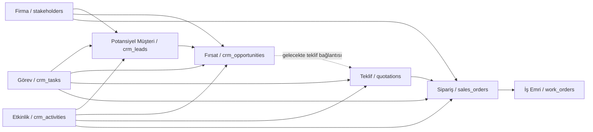

# Phase 5 CRM and Sales Workflows Report

## Objective

Phase 5 implements the first real ERP business workflow foundation for CRM and Sales while keeping the existing ERP shell, Apps Hub, Supabase backend, and existing quotation/order/customer data structures.

Permissions, advanced HR, and advanced reporting were intentionally not implemented in this phase.

## Implemented Workflows

### CRM

Implemented a new operational CRM screen at `/crm` with Turkish tab navigation:

- Potansiyel Müşteriler
- Fırsatlar
- Firmalar
- Kişiler
- Görevler
- Etkinlikler

Implemented CRM capabilities:

- Create records for leads, opportunities, firms, tasks, and activities.
- View searchable tables for all CRM workflow records.
- Filter leads, opportunities, tasks, and activities.
- Update lead, opportunity, task, and sales order statuses.
- Convert `Potansiyel Müşteri` to `Fırsat`.
- Use notes fields on leads, opportunities, firms, tasks, and activities.
- Add activity timeline foundation through `crm_activities`.
- Reuse `stakeholders` for firms and contact/person display.

### Sales

Extended Sales workflows with:

- Existing quotation lifecycle screen at `/teklifler`.
- Existing quotation creation at `/teklifler/yeni`.
- Existing quotation to order conversion.
- Existing sales order lifecycle at `/siparisler`.
- Sales order status filtering and status updates.
- New sales activity screen at `/satis-faaliyetleri`.
- Sales activities linked to opportunities, quotations, sales orders, or stakeholders.

### CRM to Sales Path

Prepared this workflow:

```text
Potansiyel Müşteri
  -> Fırsat
  -> Teklif
  -> Sipariş
```

Current implementation:

- Potansiyel Müşteri -> Fırsat is implemented through `convertLeadToOpportunity`.
- Fırsat -> Teklif is prepared through shared activity/related entity fields but does not yet auto-create a quotation.
- Teklif -> Sipariş already exists through `convertQuotationToSalesOrder`.
- Sipariş -> İş Emri already exists through `createWorkOrderFromSalesOrder`.

## Supabase Table Usage

### New additive tables

Created migration:

- `supabase/migrations/20260601120000_crm_sales_workflows.sql`

New tables:

- `crm_leads`
- `crm_opportunities`
- `crm_tasks`
- `crm_activities`

New sequence keys:

- `CRM_LEAD`
- `CRM_OPPORTUNITY`

New indexes:

- lead status and stakeholder indexes
- opportunity status, lead, and stakeholder indexes
- task status and related entity indexes
- activity related entity timeline index

RLS:

- Enabled RLS for all new tables.
- Added authenticated read/write policies as a Phase 5 foundation.
- Fine-grained permission policies are deferred because this phase explicitly excludes permissions.

### Existing tables reused

- `stakeholders`: firm/customer/supplier/subcontractor master data.
- `quotations`: existing quotation records.
- `erp_quotation_links`: quotation relationship state.
- `sales_orders`: ERP sales orders.
- `sales_order_items`: ERP sales order lines.
- `erp_audit_logs`: status/activity audit foundation.
- `erp_number_sequences`: sequence generation.

## Screens Created

- `src/features/erp/crm/CRMOperationsPage.tsx`
  - CRM tabs for leads, opportunities, firms, contacts, tasks, and activities.
- `src/features/erp/sales/SalesActivitiesPage.tsx`
  - Sales activity capture and filtering.

## Screens Reused

- `src/features/erp/quotations/ERPQuotationsPage.tsx`
  - Reused for quotation list and quotation-to-order conversion.
- `src/features/erp/sales/SalesOrdersPage.tsx`
  - Reused for sales order creation, search, lifecycle updates, and work order conversion.
- `src/features/erp/crm/StakeholdersPage.tsx`
  - Preserved as legacy detailed stakeholder management at `/paydaslar`.
- Existing stakeholder detail pages:
  - `/stakeholders/:id`
  - `/musteriler/*`
  - `/tedarikciler/*`

## Data Flow Diagram



## Files Modified

- `src/features/erp/apps/applicationRegistry.ts`
- `src/features/erp/crm/CRMOperationsPage.tsx`
- `src/features/erp/index.tsx`
- `src/features/erp/sales/SalesActivitiesPage.tsx`
- `src/features/erp/sales/SalesOrdersPage.tsx`
- `src/features/erp/shared/erpApi.ts`
- `src/features/erp/shared/statusLabels.ts`
- `src/features/erp/shared/types.ts`
- `supabase/migrations/20260601120000_crm_sales_workflows.sql`
- `docs/phase-5-crm-sales-workflows-report.md`

## Remaining Gaps

- Fırsat -> Teklif automatic creation is not implemented yet.
- CRM record detail pages are not yet split into dedicated route pages.
- Activity timeline is table-backed but not yet embedded on every entity detail page.
- Notes are stored on each CRM entity, but a unified notes component is not yet attached to every sales/CRM detail view.
- Sales order notes are supported by the table/API but not yet exposed as an inline edit field on every order row/detail.
- No role-based visibility or permission filtering was added by request.
- New RLS policies are authenticated-wide; stricter role policies should be a later permission phase.

## Risks

- The new CRM tables must be applied in Supabase before production users can access the CRM tabs without migration warnings.
- The Supabase CLI was not available in the local environment, so the migration file was created manually following existing migration naming conventions.
- `stakeholders` is reused for firms/contacts; if multiple contacts per firm become necessary, a dedicated contacts table may be needed later.
- Related entity IDs in tasks and activities are flexible references. This avoids over-engineering now, but future detail pages should provide picker components to reduce manual ID entry.

## Recommendations

- Apply `20260601120000_crm_sales_workflows.sql` to Supabase before deployment.
- Add entity detail pages for leads and opportunities next.
- Add entity pickers for task/activity related records.
- Add a direct Fırsat -> Teklif action that pre-fills the existing quotation builder without duplicating quotation logic.
- Embed `crm_activities` as a timeline on lead, opportunity, stakeholder, quotation, and sales order detail screens.

## Proposed Phase 6 Scope

Recommended Phase 6: CRM/Sales detail pages and activity timeline integration.

Scope:

- Lead detail page.
- Opportunity detail page.
- Timeline component reused across CRM and Sales.
- Fırsat -> Teklif prefill path.
- Better task/activity related entity selectors.
- Continue Turkish UI audit.

## Validation

- `npm run build` passed.
